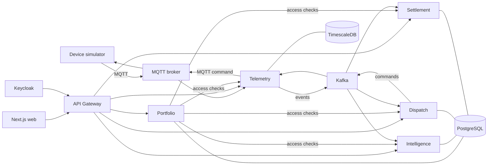

# VoltWeave

[](https://github.com/Miniks040506/voltweave/actions/workflows/ci.yml)
[](https://openjdk.org/projects/jdk/21/)
[](https://spring.io/projects/spring-boot)
[](https://nextjs.org/)

VoltWeave is an event-driven virtual power plant platform that coordinates
simulated batteries and other distributed energy resources. It ingests device
telemetry, calculates available flexibility, prepares dispatch plans, executes
device commands, measures delivery and settles customer rewards.

The repository contains a complete local V1 environment. No physical device,
external electricity market or payment provider is required.

## What the platform does

- Manages organizations, memberships, sites, devices and virtual power plants.
- Provisions revocable, device-scoped MQTT credentials.
- Validates, deduplicates and stores time-series telemetry.
- Maintains a durable latest-state device twin.
- Produces versioned forecast baselines and flexibility snapshots.
- Creates deterministic, explainable allocation previews.
- Runs manual and policy-controlled dispatch workflows.
- Tracks command acknowledgement, delivery and under-performance recovery.
- Creates immutable settlements and append-only reward ledger entries.
- Exposes customer, operator and administrator web journeys.

## Architecture



Immediate queries use authenticated HTTP. Domain lifecycle transitions use Kafka.
Device telemetry and commands use MQTT. Each backend service owns its database and
Flyway migrations; services never join or write another service's tables.

### Services

| Component | Responsibility |
|---|---|
| Web | Customer, operator and administrator interfaces |
| API Gateway | Public routing, JWT validation and correlation IDs |
| Portfolio | Tenants, sites, devices, VPP membership and authorization checks |
| Telemetry | MQTT ingress, validation, TimescaleDB history and durable twins |
| Intelligence | Forecast baselines, flexibility and deterministic optimization |
| Dispatch | Dispatch state, allocations, commands, retries and recovery |
| Settlement | Immutable delivery settlement, rewards, ledger and CSV export |
| Simulator | Deterministic meter, solar, battery and EV behavior |

### Reliability and security boundaries

- Transactional outbox publishing prevents lost events after database commits.
- Consumer inboxes and business keys make Kafka replay idempotent.
- API idempotency keys protect provisioning and dispatch commands.
- Immutable baseline snapshots preserve settlement inputs.
- Optimistic versioning and device reservations prevent conflicting dispatches.
- Keycloak provides OIDC identities and role claims.
- Resource authorization is resolved by Portfolio; clients cannot choose a tenant
  through a trusted header.
- MQTT ACLs restrict each device to its own telemetry, status, acknowledgement and
  command topics.

## Technology

| Area | Stack |
|---|---|
| Backend | Java 21, Spring Boot 4.1, Spring Cloud Gateway, Spring Security |
| Frontend | Next.js 16, React 19, TypeScript, Tailwind CSS |
| Data | PostgreSQL, TimescaleDB, Flyway |
| Messaging | Apache Kafka, Eclipse Mosquitto MQTT |
| Identity | Keycloak |
| Observability | Micrometer, Prometheus, Grafana, ECS structured logging |
| Testing | JUnit 5, Testcontainers, Maven Failsafe, k6 |
| Delivery | Docker Compose, GitHub Actions |

## Quick start

### Requirements

- Docker Desktop or Docker Engine with Compose
- PowerShell 7+
- At least 8 GB of memory available to Docker
- Java 21 only for local Maven tests or the standalone simulator
- Node.js 24 only for local frontend development

### Start the complete V1 environment

```powershell
git clone https://github.com/Miniks040506/voltweave.git
cd voltweave
Copy-Item infrastructure/compose/.env.example infrastructure/compose/.env
```

Replace every `local-*-change-me` value in the private `.env`, then run:

```powershell
.\infrastructure\compose\release.ps1
```

The release script:

1. validates the Compose model;
2. builds seven application images;
3. starts the dependency graph and waits for health checks;
4. checks Web and Gateway health;
5. verifies anonymous requests receive `401`;
6. obtains a real Keycloak token;
7. calls an authenticated API through Gateway.

Successful startup ends with:

```text
PASS web HTTP status
PASS gateway health
PASS anonymous API rejection
PASS customer token
PASS authenticated Gateway route
```

Open [http://localhost:3000](http://localhost:3000). The local users are
`customer`, `operator` and `admin`; passwords are configured in `.env`.

## Run the end-to-end product demonstration

Create a fresh customer organization, operator organization, site, battery and VPP:

```powershell
.\infrastructure\compose\demo.ps1
```

Build and run the deterministic device simulator:

```powershell
.\mvnw.cmd -pl simulator/simulation-service -am -DskipTests package

java -jar simulator/simulation-service/target/simulation-service-0.1.0-SNAPSHOT-exec.jar `
  simulator/simulation-service/scenario.local.json
```

Keep the simulator running while testing telemetry and dispatch. The generated
`scenario.local.json` contains a one-time MQTT credential and is ignored by Git.

Follow [the V1 demo walkthrough](docs/V1_DEMO.md) to inspect the customer,
operator and administrator journeys. It includes the expected evidence for
telemetry, optimization, dispatch, settlement and audit behavior.

## Endpoints

| Component | Local URL | Intended use |
|---|---|---|
| Web | `http://localhost:3000` | Product interface |
| API Gateway | `http://localhost:8080` | Public API boundary |
| Keycloak | `http://localhost:8180` | Local identity provider |
| Portfolio | `http://localhost:8081` | Local diagnostics only |
| Telemetry | `http://localhost:8082` | Local diagnostics only |
| Intelligence | `http://localhost:8083` | Local diagnostics only |
| Dispatch | `http://localhost:8084` | Local diagnostics only |
| Settlement | `http://localhost:8085` | Local diagnostics only |
| Prometheus | `http://localhost:9090` | Optional metrics profile |
| Grafana | `http://localhost:3001` | Optional acceptance dashboard |

Application clients should use Gateway rather than direct service ports.

## Testing

Run all default backend tests from the repository root:

```powershell
.\mvnw.cmd --batch-mode verify
```

Run frontend dependency, security, lint and production-build checks:

```powershell
Push-Location apps/web
npm ci
npm audit --omit=dev
npm run lint
npm run build
Pop-Location
```

Cross-service E2E and performance profiles are intentionally opt-in because they
start real infrastructure:

```powershell
.\mvnw.cmd "-Pe2e" verify
.\mvnw.cmd "-Pe2e,performance" verify
```

See [Testing Guide](docs/TESTING.md) for targeted test commands, expected results,
manual checks and troubleshooting.

## Observability

Start Prometheus and Grafana alongside the application:

```powershell
docker compose --env-file infrastructure/compose/.env `
  -f infrastructure/compose/compose.yml `
  --profile app --profile observability up -d --wait
```

Open Grafana and select `VoltWeave V1 Acceptance`. Backend logs use ECS JSON and
propagate `X-Correlation-Id`, allowing one request to be followed through Gateway
and the owning service.

## Repository structure

```text
apps/web/                       Next.js application
libs/event-contracts/           Versioned Kafka event contracts
services/api-gateway/           Public HTTP entry point
services/portfolio-service/     Tenant and resource ownership
services/telemetry-service/     Telemetry pipeline and device twins
services/intelligence-service/  Forecast, flexibility and optimization
services/dispatch-service/      Dispatch and command orchestration
services/settlement-service/    Settlement and rewards
simulator/simulation-service/   Deterministic device simulator
tests/e2e/                      Cross-service acceptance tests
infrastructure/compose/         Local platform and operational scripts
docs/                           Specifications, runbook and walkthroughs
```

## Operations

Stop containers while preserving local data:

```powershell
docker compose --env-file infrastructure/compose/.env `
  -f infrastructure/compose/compose.yml --profile app down
```

Use `release.ps1 -NoBuild` to restart existing images. Do not use `--volumes`
unless the stored sandbox data has been backed up and is intentionally being
deleted.

The [V1 operations runbook](docs/V1_RUNBOOK.md) covers logs, health, Kafka, JWT,
database connections, device credentials, backup and deliberate reset procedures.

## Project status

V1 is complete and reproducible through Docker Compose. It provides a software
sandbox for the full observe-to-settle workflow.

The following remain outside the V1 boundary:

- certified physical device integrations;
- live electricity-market participation;
- real payment processing;
- Kubernetes and multi-region deployment;
- production TLS, managed secrets and infrastructure-specific capacity planning.

## Documentation

- [V1 system requirements](docs/VOLTWEAVE_SRS.md)
- [V1 architecture and delivery plan](docs/VOLTWEAVE_V1_PLAN.md)
- [Target production-system specification](docs/VOLTWEAVE_TARGET_SRS.md)
- [Testing guide](docs/TESTING.md)
- [Demo walkthrough](docs/V1_DEMO.md)
- [Operations runbook](docs/V1_RUNBOOK.md)
