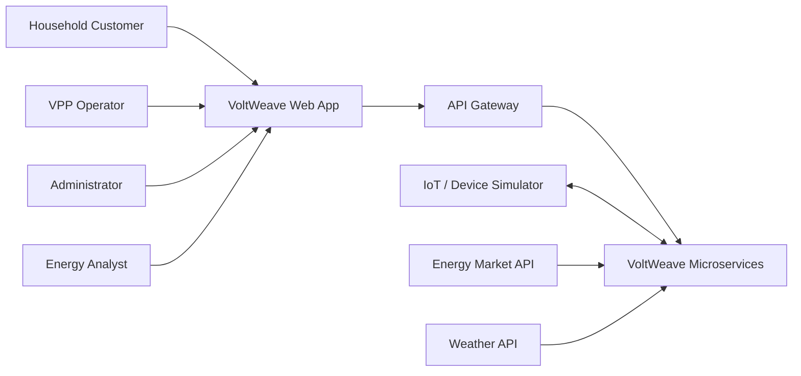
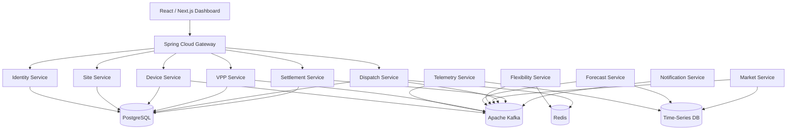
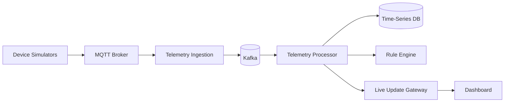
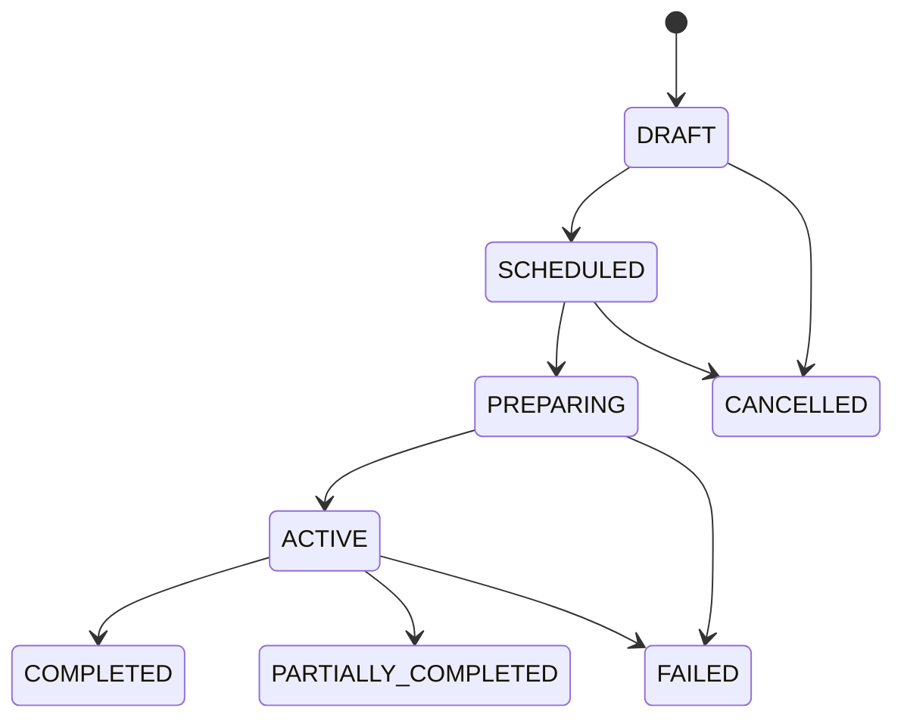
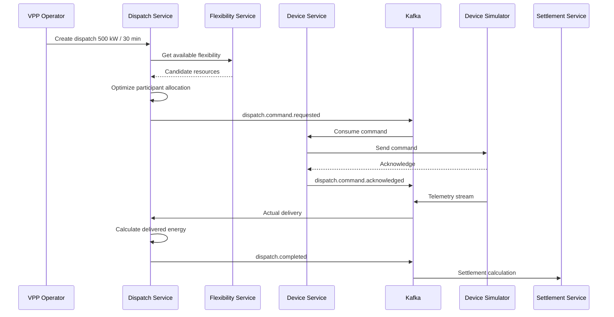
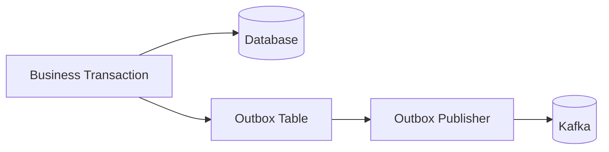
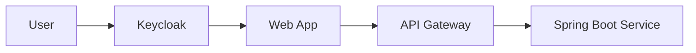
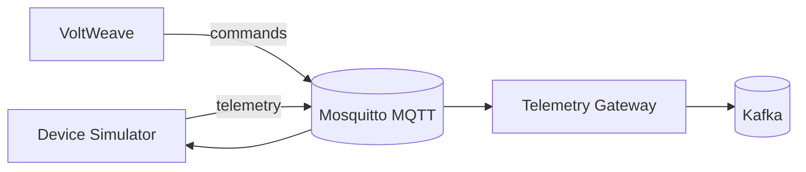
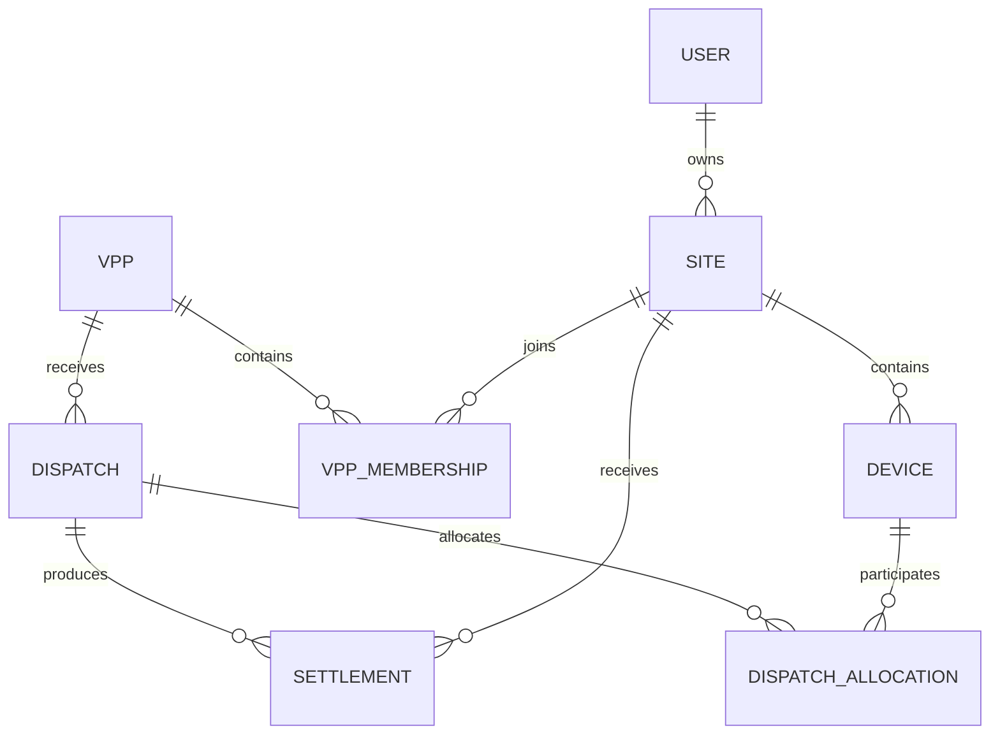

# VoltWeave
## Software Requirements Specification (SRS)
### Virtual Power Plant & Smart Energy Management Platform

**Version:** 1.0  
**Document Type:** Software Requirements Specification  
**Target Stack:** Spring Boot Microservices + React/Next.js  
**Status:** V1 requirements reference
**Primary Goal:** Production-oriented distributed system with a realistic path toward a commercial Virtual Power Plant (VPP) platform

---

# 1. Introduction

## 1.1 Purpose

VoltWeave is a **Virtual Power Plant (VPP) and Smart Energy Management Platform** designed to aggregate distributed energy resources (DERs) such as:

- Rooftop solar panels
- Residential and commercial batteries
- Electric vehicles (EVs)
- Smart meters
- Flexible household loads
- Small commercial energy systems

The platform collects real-time telemetry, forecasts energy production and consumption, determines available flexibility, schedules distributed resources, executes dispatch commands, measures delivered energy, calculates incentives, and provides operators and customers with real-time dashboards.

From a software engineering perspective, VoltWeave is designed as a **microservice-based, event-driven distributed system** demonstrating:

- Spring Boot microservices
- Apache Kafka
- PostgreSQL
- Redis
- Time-series storage
- API Gateway
- OAuth2/OIDC
- Distributed transactions
- Saga pattern
- Outbox pattern
- Idempotency
- Event sourcing concepts
- WebSocket/SSE
- Observability
- Docker/Kubernetes
- Forecasting and optimization

---

# 2. Product Vision

VoltWeave converts thousands of independent small energy devices into one coordinated virtual energy resource.

Instead of treating 1,000 batteries as isolated devices:

```text
Battery A
Battery B
Battery C
...
Battery N
```

VoltWeave treats them as a shared flexible resource:

```text
               VoltWeave VPP
                    |
       +------------+------------+
       |            |            |
    Home A       Home B       Home C
       |            |            |
   Solar+EV      Battery       Solar
```

The system should answer questions such as:

- How much power can the fleet provide right now?
- Which batteries can safely discharge?
- Which EVs must remain charged for customer departure times?
- What is the predicted household demand in the next hour?
- How much renewable energy will be produced?
- Should the system charge batteries now or later?
- Which DERs should participate in a dispatch event?
- Did each device actually deliver the requested power?
- How much incentive should each participant receive?

---

# 3. Business Objectives

## BO-01 — Aggregate Distributed Energy Resources

Allow thousands or eventually millions of distributed energy devices to be registered, monitored, and grouped into virtual power plants.

## BO-02 — Increase Renewable Energy Utilization

Store excess renewable energy when supply exceeds demand and release stored energy during high-demand periods.

## BO-03 — Provide Grid Flexibility

Provide controllable demand reduction, battery discharge, EV charging management, and other flexibility services.

## BO-04 — Reduce Customer Energy Cost

Optimize device schedules using energy prices, forecasts, battery constraints, and user preferences.

## BO-05 — Enable VPP Operator Revenue

Allow VPP operators to create energy dispatch events and calculate the financial settlement for participating households.

## BO-06 — Build a Production-Like Distributed System

The project must demonstrate architecture and engineering concerns beyond CRUD applications.

---

# 4. Scope

## 4.1 In Scope — Version 1

VoltWeave V1 supports:

1. User registration and authentication.
2. Household/site registration.
3. Device registration.
4. Device telemetry ingestion.
5. Smart meter readings.
6. Battery state monitoring.
7. Solar generation monitoring.
8. EV charging state monitoring.
9. Near-real-time fleet dashboard.
10. Device grouping into Virtual Power Plants.
11. Day-ahead and short-term load forecasting.
12. Solar generation forecasting.
13. Electricity price ingestion.
14. Flexibility calculation.
15. Dispatch event creation.
16. Automatic participant selection.
17. Dispatch command execution.
18. Dispatch acknowledgement.
19. Delivered-energy measurement.
20. Settlement calculation.
21. Customer reward/incentive calculation.
22. Notifications.
23. Audit logs.
24. System observability.
25. Simulation mode for repeatable acceptance testing.

## 4.2 Out of Scope — Initial Version

The initial V1 release will not directly control real physical electricity infrastructure.

Instead:

- Devices are simulated.
- Grid market prices may be simulated or loaded from test datasets.
- Battery/solar/EV devices are represented by device simulators.
- Commands use a mock IoT protocol or MQTT simulator.

Future versions may integrate real:

- MQTT-enabled devices
- Smart inverters
- EV chargers
- Smart meters
- Utility APIs
- Energy market APIs

---

# 5. Stakeholders

| Stakeholder | Description |
|---|---|
| Household Customer | Owns or manages DER devices |
| VPP Operator | Operates one or more virtual power plants |
| Energy Analyst | Reviews forecasts, flexibility and performance |
| System Administrator | Manages system configuration and users |
| Device/IoT Gateway | Sends telemetry and receives commands |
| Market Data Provider | Provides electricity price or grid signal data |
| Grid Operator | Future external participant requesting flexibility |
| Developer/DevOps | Operates and maintains the VoltWeave platform |

---

# 6. User Roles

## 6.1 CUSTOMER

Can:

- Manage household/site
- Register devices
- View live energy data
- Set battery reserve preferences
- Configure EV departure requirements
- Opt in/out of VPP programs
- View dispatch participation
- View incentives and earnings

## 6.2 VPP_OPERATOR

Can:

- Create VPPs
- Add eligible sites
- Monitor fleet capacity
- View forecasts
- Create dispatch events
- Start/stop dispatches
- Review dispatch performance
- View settlement results

## 6.3 ENERGY_ANALYST

Can:

- View forecasts
- Compare predicted vs actual values
- Analyze fleet performance
- Export energy and settlement reports

## 6.4 ADMIN

Can:

- Manage users
- Manage configuration
- Manage device types
- Review security/audit logs
- Manage system integrations

---

# 7. System Context



---

# 8. High-Level Architecture



---

# 9. Proposed Microservices

## 9.1 API Gateway Service

### Responsibilities

- Single public API entry point
- JWT validation
- Route requests to internal services
- Rate limiting
- Correlation ID propagation
- Request logging
- API version routing

### Technology

- Spring Cloud Gateway
- Redis RateLimiter
- OAuth2 Resource Server

---

## 9.2 Identity Service

### Responsibilities

- User registration
- Login integration
- Role management
- OAuth2/OIDC integration
- User profile
- Account status

### Recommended Approach

For V1:

- Keycloak for identity provider
- VoltWeave Identity Service stores VoltWeave-specific user profile data

### Main Entities

```text
UserProfile
- id
- identityProviderId
- email
- fullName
- role
- status
- createdAt
```

---

## 9.3 Site Service

A Site represents a physical energy location.

Examples:

- House
- Apartment
- Office
- Store
- Small factory

### Responsibilities

- Site registration
- Address / timezone
- Customer-site association
- Energy preference configuration
- VPP participation setting

### Entity

```text
Site
- id
- ownerId
- name
- timezone
- region
- status
- vppOptIn
- createdAt
```

---

# 10. Device Service

## 10.1 Supported Device Types

```text
SMART_METER
SOLAR_INVERTER
BATTERY
EV_CHARGER
FLEXIBLE_LOAD
```

## 10.2 Responsibilities

- Register device
- Pair device with site
- Manage device capabilities
- Track connection status
- Device metadata
- Device command capability
- Device lifecycle

## 10.3 Device Entity

```text
Device
- id
- siteId
- externalDeviceId
- deviceType
- manufacturer
- model
- ratedPowerKw
- capacityKwh
- status
- communicationProtocol
- createdAt
```

## 10.4 Battery Metadata

```text
BatteryConfiguration
- deviceId
- capacityKwh
- maxChargeKw
- maxDischargeKw
- minSocPercent
- maxSocPercent
- efficiency
```

## 10.5 EV Charger Metadata

```text
EvConfiguration
- deviceId
- maxChargingKw
- vehicleBatteryCapacityKwh
- targetSocPercent
```

---

# 11. Telemetry Service

## 11.1 Purpose

Handle high-volume device telemetry separately from transactional APIs.

## 11.2 Example Telemetry

### Smart Meter

```json
{
  "deviceId": "meter-102",
  "timestamp": "2026-08-11T13:20:00Z",
  "powerKw": 4.3,
  "energyImportKwh": 1420.3,
  "energyExportKwh": 318.7
}
```

### Battery

```json
{
  "deviceId": "battery-204",
  "timestamp": "2026-08-11T13:20:00Z",
  "stateOfCharge": 72.4,
  "powerKw": -2.1,
  "temperatureC": 31.2,
  "status": "DISCHARGING"
}
```

### Solar

```json
{
  "deviceId": "solar-509",
  "timestamp": "2026-08-11T13:20:00Z",
  "powerKw": 5.8,
  "dailyEnergyKwh": 24.7
}
```

---

# 12. Telemetry Architecture



---

# 13. Kafka Topic Design

Recommended topics:

```text
device.telemetry.raw
device.telemetry.normalized
device.status.changed

meter.reading.received
battery.state.updated
solar.production.updated
ev.state.updated

forecast.load.generated
forecast.solar.generated

market.price.updated

flexibility.site.calculated
flexibility.vpp.calculated

dispatch.created
dispatch.started
dispatch.command.requested
dispatch.command.acknowledged
dispatch.delivery.measured
dispatch.completed
dispatch.failed

settlement.calculated

notification.requested
```

---

# 14. Event Envelope Standard

All Kafka events should use a common envelope.

```json
{
  "eventId": "uuid",
  "eventType": "BatteryStateUpdated",
  "eventVersion": 1,
  "timestamp": "2026-08-11T13:20:00Z",
  "correlationId": "uuid",
  "producer": "telemetry-service",
  "payload": {}
}
```

Required properties:

- eventId
- eventType
- eventVersion
- timestamp
- correlationId
- producer
- payload

Consumers must implement idempotent processing using `eventId`.

---

# 15. VPP Service

## 15.1 Responsibilities

- Create virtual power plant
- Add/remove sites
- Track available DER capacity
- Define VPP region
- Define program rules
- Store operator ownership

## 15.2 VPP Entity

```text
VirtualPowerPlant
- id
- operatorId
- name
- region
- status
- createdAt
```

## 15.3 Membership

```text
VppMembership
- id
- vppId
- siteId
- joinedAt
- status
- participationWeight
```

---

# 16. Market Service

## Responsibilities

- Ingest electricity prices
- Store historical prices
- Provide current price
- Provide day-ahead price curve
- Publish price-change events

## Price Model

```text
EnergyPrice
- region
- timestamp
- pricePerKwh
- source
- priceType
```

For V1, prices may be generated by a simulator.

Example:

```json
{
  "region": "VN-HCM",
  "timestamp": "2026-08-11T18:00:00Z",
  "pricePerKwh": 0.18,
  "priceType": "PEAK"
}
```

---

# 17. Forecast Service

## 17.1 Forecast Types

### Load Forecast

Predict future electricity consumption.

```text
Site A

13:00  2.8 kW
14:00  3.1 kW
15:00  3.4 kW
16:00  4.2 kW
17:00  5.9 kW
18:00  7.3 kW
```

### Solar Forecast

Predict expected PV production.

```text
10:00  4.2 kW
11:00  5.3 kW
12:00  6.0 kW
13:00  5.8 kW
14:00  5.1 kW
```

## 17.2 Inputs

Possible inputs:

- Historical consumption
- Historical solar generation
- Time of day
- Day of week
- Temperature
- Cloud cover
- Weather forecast
- Holidays

## 17.3 Version 1 Forecasting

For the first implementation:

- Moving average
- Weighted moving average
- Linear regression

Advanced:

- XGBoost
- Prophet
- LSTM
- External Python ML service

The Java platform should treat forecasting as an independent service so the model implementation can evolve independently.

---

# 18. Flexibility Service

## 18.1 Purpose

Calculate how much power a site or VPP can increase/decrease without violating customer/device constraints.

## 18.2 Battery Flexibility

Example:

```text
Battery capacity = 13.5 kWh
Current SOC      = 80%
Minimum SOC      = 30%

Available energy:

13.5 * (0.80 - 0.30)
= 6.75 kWh
```

Maximum immediate dispatch is additionally constrained by:

```text
maxDischargePower
deviceAvailability
batteryTemperature
customerReserve
dispatchDuration
```

## 18.3 EV Flexibility

Suppose:

```text
Current SOC: 45%
Required SOC: 80%
Departure: 07:00
Current time: 01:00
```

VoltWeave may delay charging if sufficient future charging time remains.

## 18.4 Site Flexibility Output

```json
{
  "siteId": "site-1001",
  "timestamp": "2026-08-11T13:25:00Z",
  "upwardFlexibilityKw": 4.5,
  "downwardFlexibilityKw": 6.8,
  "availableEnergyKwh": 9.2,
  "confidence": 0.92
}
```

---

# 19. Dispatch Service

This is the central business service of VoltWeave.

## 19.1 Dispatch Definition

A dispatch is a request for the VPP to change its aggregate power consumption/production.

Example:

```text
Request:

Reduce grid demand by 500 kW
Duration: 30 minutes
Start: 18:00
```

VoltWeave identifies devices capable of contributing.

---

# 20. Dispatch Lifecycle



---

# 21. Dispatch Workflow



---

# 22. Dispatch Optimization

## 22.1 Objective

Select resources that satisfy:

```text
Total allocated flexibility >= requested power
```

while minimizing:

```text
customer inconvenience
battery degradation
energy cost
dispatch risk
```

## 22.2 Candidate Score

A simplified candidate score:

```text
score =
  availabilityWeight
+ costWeight
+ reliabilityWeight
+ stateOfChargeWeight
- degradationPenalty
- customerPreferencePenalty
```

Example:

| Battery | Available kW | SOC | Cost | Reliability | Score |
|---|---:|---:|---:|---:|---:|
| B1 | 5 | 92% | Low | 99% | 0.94 |
| B2 | 7 | 60% | Low | 98% | 0.81 |
| B3 | 4 | 40% | High | 94% | 0.55 |

System selects highest-score candidates until target power is satisfied.

## 22.3 Advanced Optimization

Future versions may use:

- Linear Programming
- Mixed Integer Linear Programming
- Constraint optimization
- Genetic algorithms
- Reinforcement learning

---

# 23. Customer Constraints

Dispatch must never violate hard safety constraints.

Examples:

## Battery

```text
SOC >= configured minimum reserve
temperature <= safe maximum
power <= max discharge power
```

## EV

```text
Required departure SOC must remain achievable
```

## Customer

```text
Customer may disable participation
Customer may define quiet hours
Customer may define battery emergency reserve
```

Hard constraints must override operator optimization.

---

# 24. Device Command Model

```json
{
  "commandId": "uuid",
  "deviceId": "battery-102",
  "dispatchId": "dispatch-5002",
  "commandType": "SET_POWER",
  "targetPowerKw": -4.5,
  "validFrom": "2026-08-11T18:00:00Z",
  "validUntil": "2026-08-11T18:30:00Z"
}
```

Result:

```json
{
  "commandId": "uuid",
  "deviceId": "battery-102",
  "status": "ACKNOWLEDGED",
  "timestamp": "2026-08-11T18:00:02Z"
}
```

---

# 25. Dispatch Reliability

The system must handle:

- Device offline
- Device command timeout
- Duplicate command
- Late acknowledgement
- Device delivers less power than requested
- Kafka duplicate messages
- Service restart during active dispatch
- Partial fleet failure

Important principle:

```text
Requested capacity != Delivered capacity
```

VoltWeave must continuously measure actual telemetry.

If a device underperforms:

```text
requested: 5 kW
actual: 1 kW
```

the optimizer may issue additional dispatch commands to another device.

---

# 26. Closed-Loop Dispatch Control

```text
Requested VPP Power
        |
        v
Allocation Engine
        |
        v
Device Commands
        |
        v
Physical / Simulated Devices
        |
        v
Actual Telemetry
        |
        v
Delivery Monitor
        |
        +------ Target met? ------ YES --> Continue
        |
        NO
        |
        v
Re-optimization
```

---

# 27. Settlement Service

## Responsibilities

- Calculate dispatch participation
- Calculate delivered energy
- Calculate reward
- Calculate penalties if applicable
- Produce household settlement statement
- Produce VPP settlement report

## Example

```text
Customer A

Dispatch:
DR-2026-0811-18

Requested:
3.0 kW

Delivered average:
2.85 kW

Duration:
30 min

Delivered energy:
1.425 kWh

Reward rate:
$0.25/kWh

Reward:
$0.356
```

---

# 28. Settlement Entity

```text
Settlement
- id
- dispatchId
- siteId
- requestedPowerKw
- deliveredEnergyKwh
- rewardRate
- totalReward
- status
- calculatedAt
```

---

# 29. Notification Service

Supported notification types:

```text
EMAIL
IN_APP
WEB_PUSH
```

Example events:

- Device offline
- Battery low
- Dispatch scheduled
- Dispatch started
- Dispatch completed
- Customer earned incentive
- VPP unavailable capacity warning

Notification service consumes Kafka events rather than being called directly by business services where possible.

---

# 30. Real-Time Dashboard

## 30.1 Household Dashboard

Display:

- Current grid consumption
- Solar generation
- Battery SOC
- EV charging
- Energy imported/exported
- Current electricity price
- Daily energy cost
- VPP participation
- Earnings

Example:

```text
VOLTWEAVE HOME

Current Power Flow

Solar
  5.8 kW
     |
     v
Home ------> Battery
3.1 kW       +2.0 kW
     |
     +------> Grid
              0.7 kW

Battery SOC
██████████████---- 76%

Today

Solar generated     23.7 kWh
Grid imported        8.2 kWh
Grid exported        6.3 kWh
VPP earnings        $1.48
```

---

# 31. Operator Dashboard

Display:

- Active VPPs
- Connected sites
- Online/offline devices
- Total installed battery capacity
- Current flexible capacity
- Current renewable generation
- Forecast load
- Forecast solar
- Active dispatches
- Dispatch success rate
- Delivered vs requested power

Example:

```text
VPP: HCM Residential Fleet

Sites                    2,842
Online devices           6,902

Battery capacity         21.4 MWh

AVAILABLE FLEXIBILITY

Discharge                8.2 MW
Charge                   5.7 MW

Current dispatch

Target                    3.0 MW
Delivered                 2.92 MW
Performance               97.3%
```

---

# 32. WebSocket / SSE

The frontend should not poll every second.

Recommended updates:

```text
telemetry updates
dispatch progress
device connectivity
VPP aggregate capacity
notifications
```

Backend options:

- WebSocket
- Server-Sent Events

V1 recommendation:

**SSE for one-direction real-time dashboard updates.**

---

# 33. Core Functional Requirements

## FR-AUTH-01

The system shall allow a user to authenticate through OAuth2/OIDC.

## FR-AUTH-02

The system shall authorize requests using role-based access control.

## FR-SITE-01

A customer shall be able to create and update a Site.

## FR-SITE-02

A customer shall be able to opt a Site into or out of VPP participation.

## FR-DEVICE-01

A customer or administrator shall be able to register a supported DER device.

## FR-DEVICE-02

Each registered device shall belong to exactly one Site.

## FR-DEVICE-03

The system shall track device ONLINE/OFFLINE status.

## FR-TEL-01

The system shall ingest device telemetry asynchronously.

## FR-TEL-02

The system shall retain historical telemetry.

## FR-TEL-03

The system shall reject or quarantine invalid telemetry.

## FR-TEL-04

Telemetry processing shall be idempotent.

## FR-VPP-01

An operator shall be able to create a VPP.

## FR-VPP-02

Eligible Sites shall be assignable to a VPP.

## FR-VPP-03

The VPP service shall expose aggregate installed capacity.

## FR-FORECAST-01

The system shall generate load forecasts.

## FR-FORECAST-02

The system shall generate solar generation forecasts.

## FR-MARKET-01

The system shall store time-dependent electricity prices.

## FR-FLEX-01

The system shall calculate available upward and downward flexibility.

## FR-FLEX-02

Flexibility calculations shall respect device and customer constraints.

## FR-DISPATCH-01

An operator shall be able to create a dispatch request.

## FR-DISPATCH-02

The system shall select eligible devices automatically.

## FR-DISPATCH-03

The system shall send commands asynchronously.

## FR-DISPATCH-04

The system shall track command acknowledgement.

## FR-DISPATCH-05

The system shall compare requested and delivered power.

## FR-DISPATCH-06

The system shall support reallocation when selected devices fail.

## FR-DISPATCH-07

The system shall maintain a persistent dispatch state.

## FR-SETTLE-01

The system shall calculate delivered energy for each participant.

## FR-SETTLE-02

The system shall calculate customer rewards.

## FR-NOTIFY-01

The system shall notify customers of relevant dispatch events.

## FR-AUDIT-01

Security-sensitive and financial actions shall be auditable.

---

# 34. Non-Functional Requirements

## NFR-PERF-01 — Telemetry Throughput

Portfolio target:

```text
10,000 telemetry events/second
```

Stretch target:

```text
100,000 events/second
```

The system should allow horizontal scaling of telemetry consumers.

## NFR-PERF-02 — API Latency

For normal transactional APIs:

```text
p95 < 300 ms
```

excluding external integrations.

## NFR-PERF-03 — Dashboard Freshness

New telemetry should normally appear on the UI within:

```text
< 2 seconds
```

## NFR-AVAIL-01

Core APIs should target:

```text
99.9% availability
```

for production architecture.

## NFR-SCALE-01

Services must be independently horizontally scalable.

## NFR-SEC-01

All external traffic shall use TLS.

## NFR-SEC-02

Access tokens shall be short-lived.

## NFR-SEC-03

Customer data shall be isolated by authorization rules.

## NFR-SEC-04

Device commands shall be authenticated.

## NFR-SEC-05

Sensitive configuration shall not be stored in source control.

## NFR-REL-01

Kafka consumers must support duplicate events.

## NFR-REL-02

Command execution must be idempotent.

## NFR-REL-03

Service restart must not lose active dispatch state.

## NFR-OBS-01

Every request/event flow must include a correlation ID.

## NFR-OBS-02

Every service must expose health and metrics endpoints.

---

# 35. Distributed System Patterns

VoltWeave should intentionally demonstrate the following patterns.

## 35.1 Database per Service

Each service owns its database/schema.

Do not create:

```text
one giant shared database
```

Preferred:

```text
site-service        -> site_db
device-service      -> device_db
vpp-service         -> vpp_db
dispatch-service    -> dispatch_db
settlement-service  -> settlement_db
```

---

# 36. Outbox Pattern

Problem:

```text
Database transaction succeeds
Kafka publish fails
```

This creates inconsistent state.

Solution:



The business record and outbox event are committed in the same database transaction.

---

# 37. Idempotent Consumer

Kafka provides at-least-once processing in many common architectures.

Consumer logic:

```text
Receive event
    |
    v
Has eventId been processed?
    |
 YES +--> Ignore safely
    |
 NO
    |
    v
Process event
    |
    v
Store eventId
```

---

# 38. Saga Pattern

Dispatch may span:

```text
Dispatch Service
Device Service
Telemetry Service
Settlement Service
Notification Service
```

Do not use one distributed database transaction.

Instead use event-driven state transitions.

Example:

```text
DispatchStarted
   |
   +--> Device commands
   |
   +--> Monitoring
   |
   +--> Completion
   |
   +--> Settlement
```

---

# 39. Redis Usage

Recommended purposes:

- Latest device state cache
- Rate limiting
- Distributed locks where necessary
- Short-lived dispatch allocation cache
- SSE connection metadata
- Real-time VPP aggregate values

Redis should not be treated as the source of truth for financial settlement.

---

# 40. Data Storage Strategy

## PostgreSQL

Use for:

- Users
- Sites
- Devices
- VPP
- Dispatch
- Membership
- Settlement
- Audit metadata

## Time-Series Database

Recommended:

- TimescaleDB

Alternative:

- InfluxDB

Use for:

- Meter readings
- Battery SOC
- Solar generation
- Device power
- Price curves
- Forecast series

## Redis

Use for:

- Current/latest state
- Cache
- Fast aggregates

---

# 41. API Design

Base URL:

```text
/api/v1
```

## Site APIs

```http
POST   /api/v1/sites
GET    /api/v1/sites/{siteId}
PUT    /api/v1/sites/{siteId}
GET    /api/v1/sites/{siteId}/energy-summary
```

## Device APIs

```http
POST   /api/v1/devices
GET    /api/v1/devices/{deviceId}
GET    /api/v1/sites/{siteId}/devices
PATCH  /api/v1/devices/{deviceId}/settings
```

## VPP APIs

```http
POST   /api/v1/vpps
GET    /api/v1/vpps/{vppId}
POST   /api/v1/vpps/{vppId}/sites/{siteId}
DELETE /api/v1/vpps/{vppId}/sites/{siteId}

GET    /api/v1/vpps/{vppId}/capacity
GET    /api/v1/vpps/{vppId}/flexibility
```

## Dispatch APIs

```http
POST   /api/v1/dispatches
GET    /api/v1/dispatches/{dispatchId}
POST   /api/v1/dispatches/{dispatchId}/cancel
GET    /api/v1/dispatches/{dispatchId}/performance
```

## Settlement APIs

```http
GET /api/v1/settlements/{id}
GET /api/v1/customers/me/earnings
GET /api/v1/dispatches/{dispatchId}/settlements
```

---

# 42. Example Create Dispatch Request

```http
POST /api/v1/dispatches
```

```json
{
  "vppId": "e740c504-1176-4cf2-8702-cba9ab858248",
  "type": "REDUCE_DEMAND",
  "targetPowerKw": 500,
  "startTime": "2026-08-11T18:00:00Z",
  "durationMinutes": 30,
  "rewardRatePerKwh": 0.25
}
```

Response:

```json
{
  "dispatchId": "66292806-c055-4872-973b-c83ece89ec90",
  "status": "SCHEDULED",
  "estimatedAvailablePowerKw": 641.4
}
```

---

# 43. Validation Rules

## Dispatch

```text
targetPowerKw > 0
durationMinutes > 0
startTime >= currentTime
VPP must be ACTIVE
available capacity must be sufficient or operator accepts partial dispatch
```

## Battery

```text
capacityKwh > 0
maxChargeKw > 0
maxDischargeKw > 0
0 <= minSoc < maxSoc <= 100
```

## EV

```text
targetSoc <= 100
targetSoc >= currentSoc
departureTime > currentTime
```

---

# 44. Security Architecture



JWT claims example:

```json
{
  "sub": "user-001",
  "roles": [
    "CUSTOMER"
  ],
  "siteIds": [
    "site-1001"
  ]
}
```

Important:

Authorization must still be checked using server-owned data.

Do not trust a client-provided `siteId` without verifying ownership.

---

# 45. Service-to-Service Security

Options:

V1:

```text
Internal network + JWT service identity
```

Advanced:

```text
mTLS
```

Each service must have a defined machine identity.

---

# 46. Observability

All Spring Boot services should use:

- Spring Boot Actuator
- Micrometer
- OpenTelemetry

Observability stack:

```text
Metrics -> Prometheus -> Grafana

Traces  -> OpenTelemetry -> Tempo

Logs    -> Loki
```

Important dashboards:

- API latency
- Kafka consumer lag
- Telemetry events/sec
- Dispatch success rate
- Command latency
- Device availability
- Settlement processing failures

---

# 47. Distributed Trace Example

```text
POST /dispatches
       |
       v
API Gateway
       |
       v
Dispatch Service
       |
       +--> Flexibility Service
       |
       +--> Kafka publish
               |
               +--> Device Service
                       |
                       +--> Device Gateway
```

The entire request should share one trace/correlation ID.

---

# 48. Resilience

Use Resilience4j for synchronous external dependencies.

Patterns:

- Timeout
- Retry
- Circuit breaker
- Bulkhead

Do not blindly retry non-idempotent operations.

Example:

```text
Weather API temporary failure

Forecast Service
      |
 Circuit Breaker
      |
Fallback:
Use last available weather forecast
```

---

# 49. Device Simulator

A device simulator is mandatory for local acceptance testing.

It should simulate:

## Smart Meter

```text
household demand curve
random variation
peak evening consumption
```

## Solar

```text
zero at night
ramp up morning
peak around midday
cloud variation
```

## Battery

```text
SOC
charge/discharge
efficiency
max power
temperature
```

## EV

```text
arrival time
departure time
initial SOC
required SOC
charging rate
```

---

# 50. Simulation Architecture



---

# 51. End-to-End Demo Scenario

A strong live demo should follow this flow.

## Step 1 — Start System

```text
docker compose up
```

System creates:

```text
500 households
500 smart meters
300 solar systems
250 batteries
120 EV chargers
```

## Step 2 — Open Operator Dashboard

Show:

```text
Sites: 500

Current load:
1.8 MW

Solar:
1.1 MW

Battery capacity:
2.7 MWh

Available flexibility:
730 kW
```

## Step 3 — Simulate Evening Peak

At simulated 18:00:

```text
Demand rises rapidly

1.8 MW
   ->
3.2 MW
```

## Step 4 — Create Dispatch

Operator requests:

```text
Reduce demand by 500 kW
for 30 minutes.
```

## Step 5 — VoltWeave Allocation

System selects:

```text
87 batteries
34 EV chargers
16 flexible loads
```

## Step 6 — Live Dashboard

```text
Target:

500 kW

Actual:

481
492
503
497
501 kW
```

## Step 7 — Failure Injection

Disconnect 10 batteries.

System detects:

```text
Dispatch under-delivery
```

Then re-optimizes another group.

## Step 8 — Completion

```text
Target energy:
250 kWh

Delivered:
247.8 kWh

Performance:
99.1%
```

## Step 9 — Settlement

Show earnings for participating households.

This scenario is the reference end-to-end acceptance flow.

---

# 52. Chaos Engineering Scenarios

Optional but highly valuable.

Admin development screen:

```text
CHAOS LAB

[ Disconnect 10% Batteries ]
[ Increase Telemetry Latency ]
[ Duplicate Kafka Events ]
[ Kill Dispatch Service ]
[ Fail Market API ]
[ Create Kafka Consumer Lag ]
```

Expected architecture behavior should be documented.

---

# 53. Frontend Pages

Recommended frontend:

```text
/
 /login

/customer
/customer/dashboard
/customer/devices
/customer/device/{id}
/customer/energy
/customer/vpp
/customer/earnings
/customer/preferences

/operator
/operator/dashboard
/operator/vpps
/operator/vpps/{id}
/operator/dispatches
/operator/dispatches/{id}
/operator/forecasts
/operator/fleet

/admin
/admin/users
/admin/devices
/admin/audit
/admin/system
```

---

# 54. Suggested Technology Stack

## Backend

```text
Java 21+
Spring Boot
Spring Cloud Gateway
Spring Security
Spring Data JPA
Spring Kafka
Spring WebFlux where appropriate
Spring Boot Actuator
Resilience4j
```

## Messaging

```text
Apache Kafka
```

## Database

```text
PostgreSQL
TimescaleDB
Redis
```

## IoT

```text
MQTT
Eclipse Mosquitto
```

## Authentication

```text
Keycloak
OAuth2
OpenID Connect
JWT
```

## Frontend

Recommended:

```text
Next.js
TypeScript
Tailwind CSS
shadcn/ui
Recharts / Apache ECharts
```

Alternative:

```text
React + Vite
```

## Infrastructure

```text
Docker
Docker Compose
Kubernetes
Helm
GitHub Actions
```

## Observability

```text
OpenTelemetry
Prometheus
Grafana
Tempo
Loki
```

---

# 55. Repository Structure

Recommended monorepo layout:

```text
voltweave/
|
+-- services/
|   +-- api-gateway/
|   +-- identity-service/
|   +-- site-service/
|   +-- device-service/
|   +-- telemetry-service/
|   +-- vpp-service/
|   +-- market-service/
|   +-- forecast-service/
|   +-- flexibility-service/
|   +-- dispatch-service/
|   +-- settlement-service/
|   +-- notification-service/
|
+-- simulator/
|   +-- device-simulator/
|
+-- frontend/
|   +-- voltweave-web/
|
+-- infrastructure/
|   +-- docker/
|   +-- kubernetes/
|   +-- kafka/
|   +-- monitoring/
|
+-- docs/
|   +-- SRS.md
|   +-- architecture/
|   +-- adr/
|   +-- api/
|   +-- diagrams/
|
+-- scripts/
|
+-- .github/
|   +-- workflows/
|
+-- README.md
```

---

# 56. Do Not Start with All Services

The logical architecture may contain 10+ services, but implementation should be incremental.

A smaller set of complete service boundaries is preferable to many empty microservices.

---

# 57. MVP Architecture

Start with:

```text
api-gateway

identity-service

site-device-service

telemetry-service

vpp-dispatch-service

settlement-service

notification-service
```

Then split them when complexity becomes real.

For example:

```text
site-device-service
```

can later become:

```text
site-service
device-service
```

Likewise:

```text
vpp-dispatch-service
```

can become:

```text
vpp-service
flexibility-service
dispatch-service
```

---

# 58. Implementation Roadmap

## Phase 0 — Foundation

Deliver:

- Monorepo
- Docker Compose
- PostgreSQL
- Kafka
- Redis
- Keycloak
- API Gateway
- CI pipeline
- Shared event standard

---

## Phase 1 — User, Site and Device Management

Deliver:

- Authentication
- Site CRUD
- Device registration
- Device simulator
- Device online/offline status

Demo:

```text
Create site
Register battery
Simulator connects
Device becomes ONLINE
```

---

## Phase 2 — Telemetry Platform

Deliver:

- MQTT
- Telemetry ingestion
- Kafka pipeline
- Time-series database
- Real-time dashboard

Demo:

```text
500 simulated devices
live telemetry dashboard
```

---

## Phase 3 — VPP Aggregation

Deliver:

- VPP creation
- Site membership
- Aggregate battery capacity
- Aggregate current power
- Flexibility calculator

Demo:

```text
HCM Fleet

Capacity:
2.7 MWh

Available:
730 kW
```

---

## Phase 4 — Dispatch Engine

Deliver:

- Dispatch creation
- Participant selection
- Device commands
- Acknowledgement
- Delivery monitoring
- Reallocation

This is the most important backend milestone.

---

## Phase 5 — Settlement

Deliver:

- Delivered energy
- Reward calculation
- Customer earnings
- Operator report

---

## Phase 6 — Forecasting

Deliver:

- Load forecast
- Solar forecast
- Price forecast integration
- Forecast accuracy metrics

---

## Phase 7 — Production Engineering

Deliver:

- OpenTelemetry
- Prometheus
- Grafana
- Distributed tracing
- Circuit breaker
- Load testing
- Chaos tests

---

## Phase 8 — Kubernetes

Deliver:

- Kubernetes deployment
- Horizontal autoscaling
- Helm
- Rolling update
- Health probes

---

# 59. Testing Strategy

## Unit Testing

Tools:

```text
JUnit 5
Mockito
AssertJ
```

Focus:

- flexibility calculation
- dispatch allocation
- settlement calculation
- constraint validation

## Integration Testing

Use:

```text
Testcontainers
```

Containers:

- PostgreSQL
- Kafka
- Redis

## Contract Testing

Recommended:

```text
Spring Cloud Contract
```

or schema validation around Kafka contracts.

## End-to-End Testing

Scenario:

```text
device telemetry
-> flexibility
-> dispatch
-> command
-> delivery
-> settlement
```

## Performance Testing

Use:

```text
k6
```

Test:

- telemetry ingestion
- operator APIs
- real-time update pipeline

---

# 60. Engineering Concerns

The architecture addresses the following concerns:

## Microservices

- Why services are separated
- Database per service
- API Gateway
- independent scaling

## Kafka

- partitioning
- ordering
- consumer groups
- retry
- DLQ
- idempotency

## Distributed Systems

- consistency
- duplicate messages
- partial failures
- eventual consistency
- Saga
- Outbox

## Caching

- Redis
- cache invalidation
- source of truth

## Data

- transactional vs time-series data
- aggregation
- historical queries

## Security

- OAuth2
- OIDC
- JWT
- RBAC
- service identity

## DevOps

- Docker
- Kubernetes
- health checks
- autoscaling

## Observability

- logs
- metrics
- distributed tracing

## Algorithms

- scheduling
- optimization
- forecasting
- resource allocation

Together, these concerns distinguish the platform from a collection of independent CRUD services.

---

# 61. Domain Model Summary



---

# 62. Main Entities

```text
UserProfile
Site
Device
BatteryConfiguration
EvConfiguration
VirtualPowerPlant
VppMembership
Dispatch
DispatchAllocation
DeviceCommand
Settlement
EnergyPrice
Forecast
AuditEvent
```

High-volume Telemetry should not be modeled as ordinary JPA transactional entities in the same database.

---

# 63. Dispatch Entity

```text
Dispatch

id
vppId

type

targetPowerKw
durationMinutes

scheduledStartTime
actualStartTime
completedAt

status

rewardRatePerKwh

requestedEnergyKwh
deliveredEnergyKwh

createdBy
createdAt

version
```

`version` may be used for optimistic locking.

---

# 64. Dispatch Allocation Entity

```text
DispatchAllocation

id
dispatchId
deviceId
siteId

allocatedPowerKw
actualAveragePowerKw

expectedEnergyKwh
deliveredEnergyKwh

status

score

createdAt
updatedAt
```

---

# 65. Error Response Standard

All REST services should expose consistent error responses.

```json
{
  "timestamp": "2026-08-11T13:20:00Z",
  "status": 400,
  "code": "DISPATCH_INSUFFICIENT_CAPACITY",
  "message": "Available capacity is lower than requested dispatch capacity.",
  "path": "/api/v1/dispatches",
  "correlationId": "f51d1d8e-..."
}
```

---

# 66. API Versioning

Use:

```text
/api/v1
```

Kafka events must also be explicitly versioned.

Do not assume internal event schemas can change without consumer impact.

---

# 67. Audit Requirements

Audit at minimum:

- VPP creation
- Membership changes
- Dispatch creation
- Dispatch cancellation
- Device command
- Customer preference change
- Settlement creation
- Admin changes

Audit record:

```text
actor
action
resourceType
resourceId
timestamp
correlationId
metadata
```

---

# 68. Privacy Requirements

VoltWeave contains potentially sensitive household behavior data.

Principles:

- Minimum required data collection
- Role-based access
- Encryption in transit
- Encryption at rest where appropriate
- Do not expose raw household telemetry to unrelated customers
- Mask sensitive fields in logs

---

# 69. Failure Cases

The architecture must explicitly handle the following cases.

## Case A

Kafka is temporarily unavailable.

Expected:

- Transactional services use outbox.
- Publisher retries later.

## Case B

Dispatch Service crashes.

Expected:

- Dispatch state remains persisted.
- Another instance resumes processing.

## Case C

Device command is duplicated.

Expected:

- `commandId` makes execution idempotent.

## Case D

Telemetry is duplicated.

Expected:

- duplicate event ID or device timestamp is handled safely.

## Case E

Forecast Service is unavailable.

Expected:

- dispatch uses latest valid forecast or conservative capacity.

## Case F

Settlement Service fails.

Expected:

- dispatch remains completed.
- settlement event is retried independently.

This separation is one of the key reasons for using microservices and asynchronous events.

---

# 70. Load Model for Local Testing

Suggested synthetic environment:

```text
Customers          10,000
Sites              10,000

Smart meters       10,000
Solar devices       6,000
Batteries           5,000
EV chargers         3,000

Total devices      24,000
```

Telemetry frequency:

```text
1 message / 5 seconds / device
```

Expected event rate:

```text
~4,800 telemetry events/sec
```

This is sufficiently large to demonstrate Kafka partitioning and consumer scaling.

---

# 71. Kafka Partition Strategy

Telemetry topics:

Partition key:

```text
deviceId
```

Reason:

Events for the same device should normally remain ordered.

Dispatch events:

Partition key:

```text
dispatchId
```

Settlement events:

Partition key:

```text
dispatchId
```

---

# 72. Dead Letter Queue

Failed events after controlled retry should be routed to topics such as:

```text
device.telemetry.dlq
dispatch.command.dlq
settlement.dlq
notification.dlq
```

A dashboard should expose DLQ counts.

---

# 73. Retry Policy

Example:

```text
Attempt 1
wait 1 second

Attempt 2
wait 5 seconds

Attempt 3
wait 30 seconds

then DLQ
```

The retry strategy should depend on event type.

Do not apply identical retry behavior to every workflow.

---

# 74. Optional Advanced Features

Future VoltWeave versions may include:

- Carbon-aware scheduling
- Dynamic tariffs
- Demand response programs
- EV smart charging
- Vehicle-to-grid simulation
- Multi-region VPP
- Energy trading simulation
- Battery degradation models
- Transformer/load constraints
- Peer-to-peer energy sharing
- Digital twins
- ML anomaly detection
- Weather-aware optimization
- OpenADR-style demand response integration
- Multi-tenant SaaS model

---

# 75. Architecture Decision Records

The project should include ADRs such as:

```text
ADR-001 Why Kafka instead of RabbitMQ
ADR-002 Why database-per-service
ADR-003 Why TimescaleDB for telemetry
ADR-004 Why MQTT for device communication
ADR-005 Why SSE instead of polling
ADR-006 Why Outbox Pattern
ADR-007 Saga choreography vs orchestration
ADR-008 Why optimization is isolated from dispatch execution
ADR-009 Monorepo vs polyrepo
ADR-010 Keycloak vs custom authentication
```

These records preserve the reasoning behind material architecture decisions.

---

# 76. Definition of Done for MVP

VoltWeave MVP is considered complete when the following scenario works end-to-end:

```text
1. Customer logs in.

2. Customer creates a Site.

3. Customer registers a simulated battery.

4. Simulator connects and streams telemetry.

5. Dashboard displays live SOC and power.

6. Operator creates a VPP.

7. Customer Site joins the VPP.

8. System calculates available flexibility.

9. Operator creates a dispatch.

10. Dispatch engine allocates devices.

11. Device commands are issued.

12. Simulator responds to the commands.

13. Telemetry proves actual delivery.

14. Dispatch completes.

15. Settlement is generated.

16. Customer sees earned reward.

17. Operator sees requested vs delivered energy.

18. Grafana shows trace/metrics for the workflow.
```

# 77. Success Metrics

Technical:

```text
Telemetry throughput
API p95 latency
Kafka consumer lag
Dispatch command latency
Dispatch target accuracy
Device availability
Event failure/DLQ rate
```

Business simulation:

```text
Flexible capacity
Renewable energy absorbed
Peak demand reduction
Customer incentives
Dispatch success percentage
```

---

# 78. Final Product Positioning

Recommended project title:

> **VoltWeave — Event-Driven Virtual Power Plant & Distributed Energy Orchestration Platform**

Short GitHub description:

> VoltWeave is a Spring Boot microservice platform that aggregates simulated solar, battery, EV and smart-meter resources into a Virtual Power Plant. It provides real-time telemetry, forecasting, flexibility calculation, distributed dispatch orchestration and customer settlement using Kafka, PostgreSQL, TimescaleDB, Redis, MQTT and Kubernetes.

System summary:

> VoltWeave simulates how thousands of household energy devices can be coordinated as one virtual power plant while solving real distributed-system problems such as streaming telemetry, partial failures, asynchronous command execution, optimization, eventual consistency and financial settlement.

---

# 79. Recommended First Implementation Boundary

Do **not** implement the complete architecture at once.

Start with this concrete system:

```text
                           Next.js
                              |
                              v
                       API Gateway
                              |
             +----------------+----------------+
             |                |                |
             v                v                v
       Identity          Energy Core       Dispatch
                         Service           Service
             |                |                |
             +----------------+----------------+
                              |
                            Kafka
                              |
             +----------------+----------------+
             |                                 |
             v                                 v
       Telemetry Service                Notification
             |
             v
       TimescaleDB

Device Simulator
      |
     MQTT
      |
Telemetry Service
```

`Energy Core Service` initially contains:

```text
Site
Device
VPP
Flexibility
```

Once the MVP works, extract the highest-change/highest-load modules into independent services.

This prevents fragmentation into many tiny services with no meaningful distributed behavior.

---

# 80. Recommended Build Priority

If the main goal is **Java Backend CV impact**, prioritize engineering depth in this order:

```text
1. Telemetry pipeline
2. Kafka event architecture
3. Dispatch orchestration
4. Failure handling
5. Idempotency
6. Outbox
7. Settlement
8. Observability
9. Load testing
10. Kubernetes
11. Forecasting
```

Implementation should prioritize correctness and operability in this order.

---

# 81. Conclusion

VoltWeave should be built as a realistic distributed energy orchestration platform rather than a generic CRUD application with many Spring Boot services.

The key technical story is:

```text
Thousands of independent devices
            |
            v
 Real-time telemetry streaming
            |
            v
  Distributed state estimation
            |
            v
  Flexibility calculation
            |
            v
 Optimization / allocation
            |
            v
 Asynchronous device dispatch
            |
            v
 Actual delivery measurement
            |
            v
 Financial settlement
```

That end-to-end flow gives the project strong technical depth across:

- Java
- Spring Boot
- Microservices
- Kafka
- Distributed systems
- Real-time systems
- Databases
- Security
- Cloud infrastructure
- Algorithms
- Observability

The same foundation can be expanded into a broader open-source or SaaS platform.
