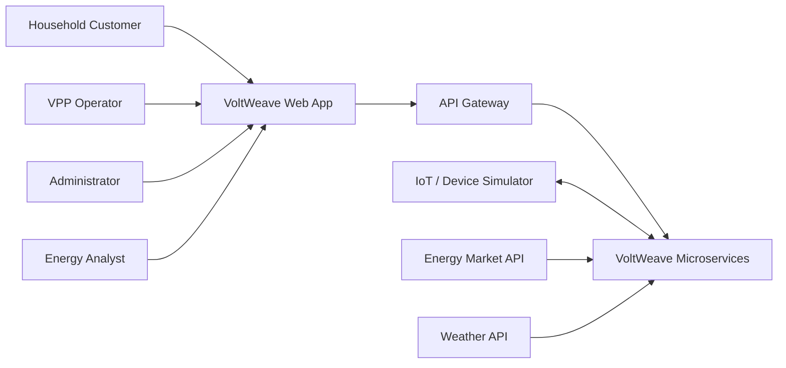
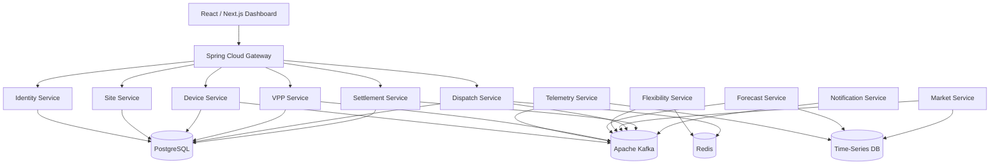
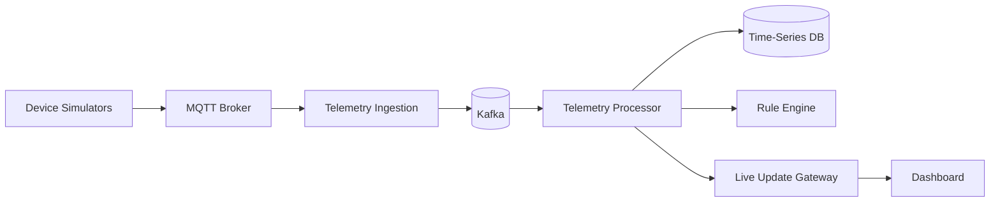
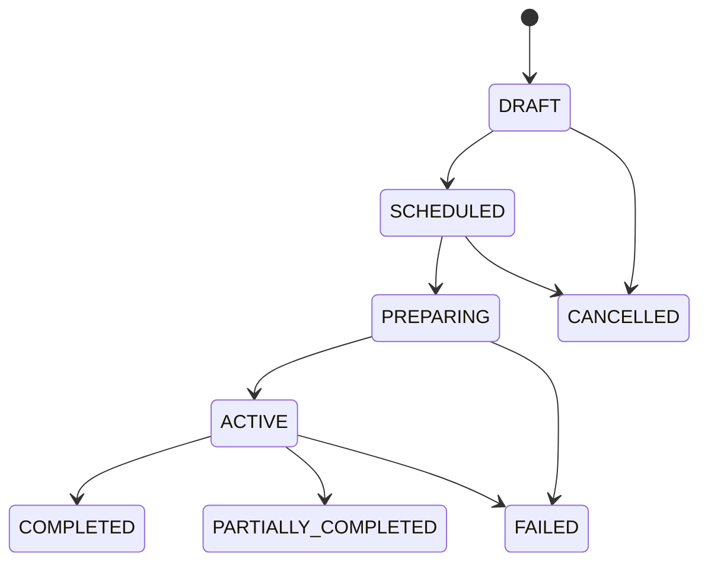
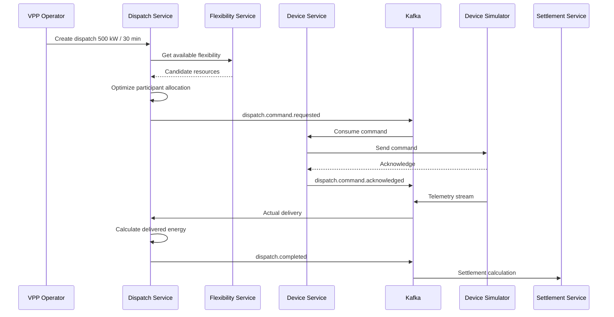
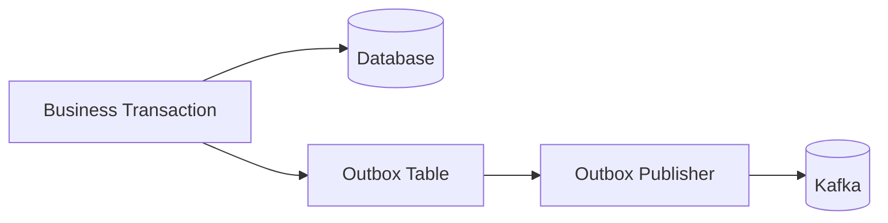
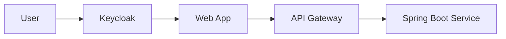
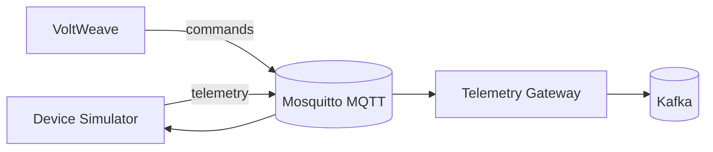
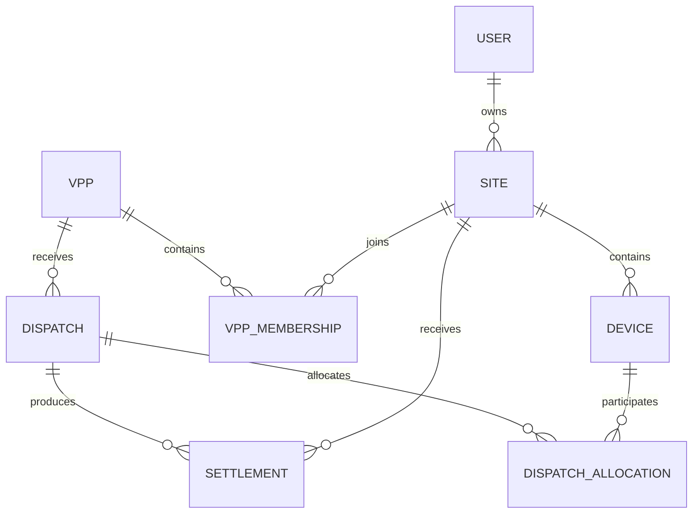

# VoltWeave
## Full Production Software Requirements Specification (SRS)
### Virtual Power Plant & Distributed Energy Resource Orchestration Platform

**Version:** 3.0  
**Status:** Complete Target-System Specification  
**Primary Backend:** Java 21+ / Spring Boot  
**Frontend:** Next.js / React + TypeScript  
**Architecture:** Event-driven microservices + IoT + streaming + optimization  
**Deployment Target:** Kubernetes  
**Scope Rule:** This SRS describes the **full product that must be built**. Features are specified as target-system requirements rather than reduced implementation phases.

---

# 1. Introduction

## 1.1 Purpose

VoltWeave is a **Virtual Power Plant (VPP) and Smart Energy Management Platform** designed to aggregate distributed energy resources (DERs) such as:

- Rooftop solar panels
- Residential and commercial batteries
- Electric vehicles (EVs)
- Smart meters
- Flexible household loads
- Small commercial energy systems

The platform collects real-time telemetry, forecasts energy production and consumption, determines available flexibility, schedules distributed resources, executes dispatch commands, measures delivered energy, calculates incentives, and provides operators and customers with real-time dashboards.

From a software engineering perspective, VoltWeave is designed as a **microservice-based, event-driven distributed system** demonstrating:

- Spring Boot microservices
- Apache Kafka
- PostgreSQL
- Redis
- Time-series storage
- API Gateway
- OAuth2/OIDC
- Distributed transactions
- Saga pattern
- Outbox pattern
- Idempotency
- Event sourcing concepts
- WebSocket/SSE
- Observability
- Docker/Kubernetes
- Forecasting and optimization

---


# 2. Product Vision

VoltWeave converts thousands of independent small energy devices into one coordinated virtual energy resource.

Instead of treating 1,000 batteries as isolated devices:

```text
Battery A
Battery B
Battery C
...
Battery N
```

VoltWeave treats them as a shared flexible resource:

```text
               VoltWeave VPP
                    |
       +------------+------------+
       |            |            |
    Home A       Home B       Home C
       |            |            |
   Solar+EV      Battery       Solar
```

The system should answer questions such as:

- How much power can the fleet provide right now?
- Which batteries can safely discharge?
- Which EVs must remain charged for customer departure times?
- What is the predicted household demand in the next hour?
- How much renewable energy will be produced?
- Should the system charge batteries now or later?
- Which DERs should participate in a dispatch event?
- Did each device actually deliver the requested power?
- How much incentive should each participant receive?

---


# 3. Business Objectives

## BO-01 — Aggregate Distributed Energy Resources

Allow thousands or eventually millions of distributed energy devices to be registered, monitored, and grouped into virtual power plants.

## BO-02 — Increase Renewable Energy Utilization

Store excess renewable energy when supply exceeds demand and release stored energy during high-demand periods.

## BO-03 — Provide Grid Flexibility

Provide controllable demand reduction, battery discharge, EV charging management, and other flexibility services.

## BO-04 — Reduce Customer Energy Cost

Optimize device schedules using energy prices, forecasts, battery constraints, and user preferences.

## BO-05 — Enable VPP Operator Revenue

Allow VPP operators to create energy dispatch events and calculate the financial settlement for participating households.

## BO-06 — Build a Production-Like Distributed System

The system must implement architecture and engineering concerns beyond CRUD applications.

---


# 4. Scope

## 4.1 Complete Product Scope

The complete VoltWeave target product shall implement:

1. OAuth2/OIDC authentication and application user profiles.
2. Multi-tenant organizations and organization memberships.
3. Residential, commercial, industrial and community sites.
4. Customer energy preferences and opt-out controls.
5. Device registry, capabilities, provisioning, credential lifecycle and health.
6. Real physical-device adapters and a full device simulation environment.
7. Secure MQTT device connectivity.
8. Smart-meter telemetry.
9. Battery telemetry and control.
10. Solar-inverter telemetry and curtailment capability where supported.
11. EV/EV-charger telemetry and smart charging.
12. Flexible-load telemetry/control.
13. High-throughput telemetry ingestion.
14. Kafka event streaming.
15. Telemetry validation, normalization, quality classification and deduplication.
16. Time-series persistence, aggregation, downsampling and retention.
17. Real-time digital twins.
18. Virtual Power Plant creation, lifecycle and membership.
19. Market price/tariff/grid-signal integrations.
20. Weather observations and forecast integrations.
21. Site and VPP load forecasting.
22. Site and VPP solar-generation forecasting.
23. Forecast model lifecycle, versioning and accuracy evaluation.
24. Battery flexibility calculation.
25. EV flexibility calculation.
26. Flexible-load flexibility calculation.
27. Site and VPP flexibility aggregation.
28. Greedy, weighted-score, Linear Programming and MILP optimization.
29. Dispatch creation, validation, scheduling, activation and cancellation.
30. Resource allocation.
31. Idempotent device command delivery.
32. Device command acknowledgement and retry/expiry handling.
33. Continuous requested-vs-actual delivery monitoring.
34. Automatic dispatch rebalancing.
35. Dispatch completion and performance KPIs.
36. Baseline calculation.
37. Financial settlement.
38. Immutable customer reward ledger and compensating adjustments.
39. Realtime customer/operator dashboards.
40. In-app, email and web-push notifications.
41. CSV, XLSX, PDF and JSON reports/exports.
42. Append-only audit history.
43. Versioned system/business configuration.
44. Cluster-safe scheduled jobs.
45. SSE/WebSocket realtime fanout.
46. Simulation of device fleets, demand, weather, prices and failures.
47. Transactional Outbox.
48. Idempotent Kafka consumers.
49. Retry, DLQ and safe reprocessing.
50. OpenAPI and versioned Kafka event contracts.
51. Metrics, logs, distributed tracing and alerting.
52. Docker and Kubernetes deployment.
53. Autoscaling and high availability.
54. Backup and disaster-recovery procedures.
55. CI/CD, static analysis, dependency/container/secret scanning.
56. Unit, integration, contract, E2E, load, soak, chaos and security testing.

## 4.2 Product Boundaries and External Responsibilities

VoltWeave shall support both real integration adapters and simulation adapters. The software controls devices only through authorized device/vendor protocols; device firmware and physical electrical safety remain external responsibilities.

VoltWeave does not own:

- Physical battery, EV charger, smart meter or inverter firmware.
- Utility transmission/distribution infrastructure.
- External weather-provider infrastructure.
- External market/operator infrastructure.
- External email/web-push infrastructure.
- Identity-provider password storage when an external OIDC provider is used.

The `simulation-service` is mandatory for automated testing and deterministic acceptance scenarios, but simulation is not a substitute for the real device/provider adapter boundaries defined by this SRS.

---

# 5. Stakeholders

| Stakeholder | Description |
|---|---|
| Household Customer | Owns or manages DER devices |
| VPP Operator | Operates one or more virtual power plants |
| Energy Analyst | Reviews forecasts, flexibility and performance |
| System Administrator | Manages system configuration and users |
| Device/IoT Gateway | Sends telemetry and receives commands |
| Market Data Provider | Provides electricity price or grid signal data |
| Grid Operator | Future external participant requesting flexibility |
| Developer/DevOps | Operates and maintains the VoltWeave platform |

---


# 6. User Roles

## 6.1 CUSTOMER

Can:

- Manage household/site
- Register devices
- View live energy data
- Set battery reserve preferences
- Configure EV departure requirements
- Opt in/out of VPP programs
- View dispatch participation
- View incentives and earnings

## 6.2 VPP_OPERATOR

Can:

- Create VPPs
- Add eligible sites
- Monitor fleet capacity
- View forecasts
- Create dispatch events
- Start/stop dispatches
- Review dispatch performance
- View settlement results

## 6.3 ENERGY_ANALYST

Can:

- View forecasts
- Compare predicted vs actual values
- Analyze fleet performance
- Export energy and settlement reports

## 6.4 ADMIN

Can:

- Manage users
- Manage configuration
- Manage device types
- Review security/audit logs
- Manage system integrations

---


# 7. System Context



---


# 8. High-Level Architecture



---


# 9. Proposed Microservices

## 9.1 API Gateway Service

### Responsibilities

- Single public API entry point
- JWT validation
- Route requests to internal services
- Rate limiting
- Correlation ID propagation
- Request logging
- API version routing

### Technology

- Spring Cloud Gateway
- Redis RateLimiter
- OAuth2 Resource Server

---

## 9.2 Identity Service

### Responsibilities

- User registration
- Login integration
- Role management
- OAuth2/OIDC integration
- User profile
- Account status

### Required Identity Architecture

- Keycloak or an equivalent OIDC provider handles authentication.
- VoltWeave Identity/Profile Service stores VoltWeave-specific user profile data.
- Domain microservices do not store raw user passwords.

### Main Entities

```text
UserProfile
- id
- identityProviderId
- email
- fullName
- role
- status
- createdAt
```

---

## 9.3 Site Service

A Site represents a physical energy location.

Examples:

- House
- Apartment
- Office
- Store
- Small factory

### Responsibilities

- Site registration
- Address / timezone
- Customer-site association
- Energy preference configuration
- VPP participation setting

### Entity

```text
Site
- id
- ownerId
- name
- timezone
- region
- status
- vppOptIn
- createdAt
```

---


# 10. Device Service

## 10.1 Supported Device Types

```text
SMART_METER
SOLAR_INVERTER
BATTERY
EV_CHARGER
FLEXIBLE_LOAD
```

## 10.2 Responsibilities

- Register device
- Pair device with site
- Manage device capabilities
- Track connection status
- Device metadata
- Device command capability
- Device lifecycle

## 10.3 Device Entity

```text
Device
- id
- siteId
- externalDeviceId
- deviceType
- manufacturer
- model
- ratedPowerKw
- capacityKwh
- status
- communicationProtocol
- createdAt
```

## 10.4 Battery Metadata

```text
BatteryConfiguration
- deviceId
- capacityKwh
- maxChargeKw
- maxDischargeKw
- minSocPercent
- maxSocPercent
- efficiency
```

## 10.5 EV Charger Metadata

```text
EvConfiguration
- deviceId
- maxChargingKw
- vehicleBatteryCapacityKwh
- targetSocPercent
```

---


# 11. Telemetry Service

## 11.1 Purpose

Handle high-volume device telemetry separately from transactional APIs.

## 11.2 Example Telemetry

### Smart Meter

```json
{
  "deviceId": "meter-102",
  "timestamp": "2026-08-11T13:20:00Z",
  "powerKw": 4.3,
  "energyImportKwh": 1420.3,
  "energyExportKwh": 318.7
}
```

### Battery

```json
{
  "deviceId": "battery-204",
  "timestamp": "2026-08-11T13:20:00Z",
  "stateOfCharge": 72.4,
  "powerKw": -2.1,
  "temperatureC": 31.2,
  "status": "DISCHARGING"
}
```

### Solar

```json
{
  "deviceId": "solar-509",
  "timestamp": "2026-08-11T13:20:00Z",
  "powerKw": 5.8,
  "dailyEnergyKwh": 24.7
}
```

---


# 12. Telemetry Architecture



---


# 13. Kafka Topic Design

Recommended topics:

```text
device.telemetry.raw
device.telemetry.normalized
device.status.changed

meter.reading.received
battery.state.updated
solar.production.updated
ev.state.updated

forecast.load.generated
forecast.solar.generated

market.price.updated

flexibility.site.calculated
flexibility.vpp.calculated

dispatch.created
dispatch.started
dispatch.command.requested
dispatch.command.acknowledged
dispatch.delivery.measured
dispatch.completed
dispatch.failed

settlement.calculated

notification.requested
```

---


# 14. Event Envelope Standard

All Kafka events should use a common envelope.

```json
{
  "eventId": "uuid",
  "eventType": "BatteryStateUpdated",
  "eventVersion": 1,
  "timestamp": "2026-08-11T13:20:00Z",
  "correlationId": "uuid",
  "producer": "telemetry-service",
  "payload": {}
}
```

Required properties:

- eventId
- eventType
- eventVersion
- timestamp
- correlationId
- producer
- payload

Consumers must implement idempotent processing using `eventId`.

---


# 15. VPP Service

## 15.1 Responsibilities

- Create virtual power plant
- Add/remove sites
- Track available DER capacity
- Define VPP region
- Define program rules
- Store operator ownership

## 15.2 VPP Entity

```text
VirtualPowerPlant
- id
- operatorId
- name
- region
- status
- createdAt
```

## 15.3 Membership

```text
VppMembership
- id
- vppId
- siteId
- joinedAt
- status
- participationWeight
```

---


# 16. Market Service

## Responsibilities

- Ingest electricity prices
- Store historical prices
- Provide current price
- Provide day-ahead price curve
- Publish price-change events

## Price Model

```text
EnergyPrice
- region
- timestamp
- pricePerKwh
- source
- priceType
```

The platform shall support both real provider adapters and simulation providers. Provider mode is environment/configuration dependent.

Example:

```json
{
  "region": "VN-HCM",
  "timestamp": "2026-08-11T18:00:00Z",
  "pricePerKwh": 0.18,
  "priceType": "PEAK"
}
```

---


# 17. Forecast Service

## 17.1 Forecast Types

### Load Forecast

Predict future electricity consumption.

```text
Site A

13:00  2.8 kW
14:00  3.1 kW
15:00  3.4 kW
16:00  4.2 kW
17:00  5.9 kW
18:00  7.3 kW
```

### Solar Forecast

Predict expected PV production.

```text
10:00  4.2 kW
11:00  5.3 kW
12:00  6.0 kW
13:00  5.8 kW
14:00  5.1 kW
```

## 17.2 Inputs

Possible inputs:

- Historical consumption
- Historical solar generation
- Time of day
- Day of week
- Temperature
- Cloud cover
- Weather forecast
- Holidays

## 17.3 Forecasting Model Requirements

Required baseline model implementations:

- Moving average
- Weighted moving average
- Linear regression

Required advanced/pluggable model support:

- XGBoost
- Prophet
- LSTM
- External Python ML service

The Java platform should treat forecasting as an independent service so the model implementation can evolve independently.

---


# 18. Flexibility Service

## 18.1 Purpose

Calculate how much power a site or VPP can increase/decrease without violating customer/device constraints.

## 18.2 Battery Flexibility

Example:

```text
Battery capacity = 13.5 kWh
Current SOC      = 80%
Minimum SOC      = 30%

Available energy:

13.5 * (0.80 - 0.30)
= 6.75 kWh
```

Maximum immediate dispatch is additionally constrained by:

```text
maxDischargePower
deviceAvailability
batteryTemperature
customerReserve
dispatchDuration
```

## 18.3 EV Flexibility

Suppose:

```text
Current SOC: 45%
Required SOC: 80%
Departure: 07:00
Current time: 01:00
```

VoltWeave may delay charging if sufficient future charging time remains.

## 18.4 Site Flexibility Output

```json
{
  "siteId": "site-1001",
  "timestamp": "2026-08-11T13:25:00Z",
  "upwardFlexibilityKw": 4.5,
  "downwardFlexibilityKw": 6.8,
  "availableEnergyKwh": 9.2,
  "confidence": 0.92
}
```

---


# 19. Dispatch Service

This is the central business service of VoltWeave.

## 19.1 Dispatch Definition

A dispatch is a request for the VPP to change its aggregate power consumption/production.

Example:

```text
Request:

Reduce grid demand by 500 kW
Duration: 30 minutes
Start: 18:00
```

VoltWeave identifies devices capable of contributing.

---


# 20. Dispatch Lifecycle



---


# 21. Dispatch Workflow



---


# 22. Dispatch Optimization

## 22.1 Objective

Select resources that satisfy:

```text
Total allocated flexibility >= requested power
```

while minimizing:

```text
customer inconvenience
battery degradation
energy cost
dispatch risk
```

## 22.2 Candidate Score

A simplified candidate score:

```text
score =
  availabilityWeight
+ costWeight
+ reliabilityWeight
+ stateOfChargeWeight
- degradationPenalty
- customerPreferencePenalty
```

Example:

| Battery | Available kW | SOC | Cost | Reliability | Score |
|---|---:|---:|---:|---:|---:|
| B1 | 5 | 92% | Low | 99% | 0.94 |
| B2 | 7 | 60% | Low | 98% | 0.81 |
| B3 | 4 | 40% | High | 94% | 0.55 |

System selects highest-score candidates until target power is satisfied.

## 22.3 Required Optimization Strategies

The complete target system shall support:

- Greedy allocation.
- Weighted-score allocation.
- Linear Programming.
- Mixed Integer Linear Programming.
- Pluggable constraint-optimization solver interfaces.

Genetic algorithms and reinforcement learning may be implemented only as additional experimental strategies; they shall not replace the deterministic required strategies above.

---


# 23. Customer Constraints

Dispatch must never violate hard safety constraints.

Examples:

## Battery

```text
SOC >= configured minimum reserve
temperature <= safe maximum
power <= max discharge power
```

## EV

```text
Required departure SOC must remain achievable
```

## Customer

```text
Customer may disable participation
Customer may define quiet hours
Customer may define battery emergency reserve
```

Hard constraints must override operator optimization.

---


# 24. Device Command Model

```json
{
  "commandId": "uuid",
  "deviceId": "battery-102",
  "dispatchId": "dispatch-5002",
  "commandType": "SET_POWER",
  "targetPowerKw": -4.5,
  "validFrom": "2026-08-11T18:00:00Z",
  "validUntil": "2026-08-11T18:30:00Z"
}
```

Result:

```json
{
  "commandId": "uuid",
  "deviceId": "battery-102",
  "status": "ACKNOWLEDGED",
  "timestamp": "2026-08-11T18:00:02Z"
}
```

---


# 25. Dispatch Reliability

The system must handle:

- Device offline
- Device command timeout
- Duplicate command
- Late acknowledgement
- Device delivers less power than requested
- Kafka duplicate messages
- Service restart during active dispatch
- Partial fleet failure

Important principle:

```text
Requested capacity != Delivered capacity
```

VoltWeave must continuously measure actual telemetry.

If a device underperforms:

```text
requested: 5 kW
actual: 1 kW
```

the optimizer may issue additional dispatch commands to another device.

---


# 26. Closed-Loop Dispatch Control

```text
Requested VPP Power
        |
        v
Allocation Engine
        |
        v
Device Commands
        |
        v
Physical / Simulated Devices
        |
        v
Actual Telemetry
        |
        v
Delivery Monitor
        |
        +------ Target met? ------ YES --> Continue
        |
        NO
        |
        v
Re-optimization
```

---


# 27. Settlement Service

## Responsibilities

- Calculate dispatch participation
- Calculate delivered energy
- Calculate reward
- Calculate penalties if applicable
- Produce household settlement statement
- Produce VPP settlement report

## Example

```text
Customer A

Dispatch:
DR-2026-0811-18

Requested:
3.0 kW

Delivered average:
2.85 kW

Duration:
30 min

Delivered energy:
1.425 kWh

Reward rate:
$0.25/kWh

Reward:
$0.356
```

---


# 28. Settlement Entity

```text
Settlement
- id
- dispatchId
- siteId
- requestedPowerKw
- deliveredEnergyKwh
- rewardRate
- totalReward
- status
- calculatedAt
```

---


# 29. Notification Service

Supported notification types:

```text
EMAIL
IN_APP
WEB_PUSH
```

Example events:

- Device offline
- Battery low
- Dispatch scheduled
- Dispatch started
- Dispatch completed
- Customer earned incentive
- VPP unavailable capacity warning

Notification service consumes Kafka events rather than being called directly by business services where possible.

---


# 30. Real-Time Dashboard

## 30.1 Household Dashboard

Display:

- Current grid consumption
- Solar generation
- Battery SOC
- EV charging
- Energy imported/exported
- Current electricity price
- Daily energy cost
- VPP participation
- Earnings

Example:

```text
VOLTWEAVE HOME

Current Power Flow

Solar
  5.8 kW
     |
     v
Home ------> Battery
3.1 kW       +2.0 kW
     |
     +------> Grid
              0.7 kW

Battery SOC
██████████████---- 76%

Today

Solar generated     23.7 kWh
Grid imported        8.2 kWh
Grid exported        6.3 kWh
VPP earnings        $1.48
```

---


# 31. Operator Dashboard

Display:

- Active VPPs
- Connected sites
- Online/offline devices
- Total installed battery capacity
- Current flexible capacity
- Current renewable generation
- Forecast load
- Forecast solar
- Active dispatches
- Dispatch success rate
- Delivered vs requested power

Example:

```text
VPP: HCM Residential Fleet

Sites                    2,842
Online devices           6,902

Battery capacity         21.4 MWh

AVAILABLE FLEXIBILITY

Discharge                8.2 MW
Charge                   5.7 MW

Current dispatch

Target                    3.0 MW
Delivered                 2.92 MW
Performance               97.3%
```

---


# 32. WebSocket / SSE

The frontend should not poll every second.

Recommended updates:

```text
telemetry updates
dispatch progress
device connectivity
VPP aggregate capacity
notifications
```

Backend options:

- WebSocket
- Server-Sent Events

Production recommendation:

**Use SSE for one-direction real-time dashboard updates; use WebSocket only where bidirectional realtime interaction is required.**

---


# 33. Core Functional Requirements

## FR-AUTH-01

The system shall allow a user to authenticate through OAuth2/OIDC.

## FR-AUTH-02

The system shall authorize requests using role-based access control.

## FR-SITE-01

A customer shall be able to create and update a Site.

## FR-SITE-02

A customer shall be able to opt a Site into or out of VPP participation.

## FR-DEVICE-01

A customer or administrator shall be able to register a supported DER device.

## FR-DEVICE-02

Each registered device shall belong to exactly one Site.

## FR-DEVICE-03

The system shall track device ONLINE/OFFLINE status.

## FR-TEL-01

The system shall ingest device telemetry asynchronously.

## FR-TEL-02

The system shall retain historical telemetry.

## FR-TEL-03

The system shall reject or quarantine invalid telemetry.

## FR-TEL-04

Telemetry processing shall be idempotent.

## FR-VPP-01

An operator shall be able to create a VPP.

## FR-VPP-02

Eligible Sites shall be assignable to a VPP.

## FR-VPP-03

The VPP service shall expose aggregate installed capacity.

## FR-FORECAST-01

The system shall generate load forecasts.

## FR-FORECAST-02

The system shall generate solar generation forecasts.

## FR-MARKET-01

The system shall store time-dependent electricity prices.

## FR-FLEX-01

The system shall calculate available upward and downward flexibility.

## FR-FLEX-02

Flexibility calculations shall respect device and customer constraints.

## FR-DISPATCH-01

An operator shall be able to create a dispatch request.

## FR-DISPATCH-02

The system shall select eligible devices automatically.

## FR-DISPATCH-03

The system shall send commands asynchronously.

## FR-DISPATCH-04

The system shall track command acknowledgement.

## FR-DISPATCH-05

The system shall compare requested and delivered power.

## FR-DISPATCH-06

The system shall support reallocation when selected devices fail.

## FR-DISPATCH-07

The system shall maintain a persistent dispatch state.

## FR-SETTLE-01

The system shall calculate delivered energy for each participant.

## FR-SETTLE-02

The system shall calculate customer rewards.

## FR-NOTIFY-01

The system shall notify customers of relevant dispatch events.

## FR-AUDIT-01

Security-sensitive and financial actions shall be auditable.

---


# 34. Non-Functional Requirements

## NFR-PERF-01 — Telemetry Throughput

Required benchmark:

```text
10,000 telemetry events/second
```

High-scale target architecture:

```text
100,000 events/second
```

The system should allow horizontal scaling of telemetry consumers.

## NFR-PERF-02 — API Latency

For normal transactional APIs:

```text
p95 < 300 ms
```

excluding external integrations.

## NFR-PERF-03 — Dashboard Freshness

New telemetry should normally appear on the UI within:

```text
< 2 seconds
```

## NFR-AVAIL-01

Core APIs should target:

```text
99.9% availability
```

for production architecture.

## NFR-SCALE-01

Services must be independently horizontally scalable.

## NFR-SEC-01

All external traffic shall use TLS.

## NFR-SEC-02

Access tokens shall be short-lived.

## NFR-SEC-03

Customer data shall be isolated by authorization rules.

## NFR-SEC-04

Device commands shall be authenticated.

## NFR-SEC-05

Sensitive configuration shall not be stored in source control.

## NFR-REL-01

Kafka consumers must support duplicate events.

## NFR-REL-02

Command execution must be idempotent.

## NFR-REL-03

Service restart must not lose active dispatch state.

## NFR-OBS-01

Every request/event flow must include a correlation ID.

## NFR-OBS-02

Every service must expose health and metrics endpoints.

---


# 35. Distributed System Patterns

VoltWeave should intentionally demonstrate the following patterns.

## 35.1 Database per Service

Each service owns its database/schema.

Do not create:

```text
one giant shared database
```

Preferred:

```text
site-service        -> site_db
device-service      -> device_db
vpp-service         -> vpp_db
dispatch-service    -> dispatch_db
settlement-service  -> settlement_db
```

---


# 36. Outbox Pattern

Problem:

```text
Database transaction succeeds
Kafka publish fails
```

This creates inconsistent state.

Solution:



The business record and outbox event are committed in the same database transaction.

---


# 37. Idempotent Consumer

Kafka provides at-least-once processing in many common architectures.

Consumer logic:

```text
Receive event
    |
    v
Has eventId been processed?
    |
 YES +--> Ignore safely
    |
 NO
    |
    v
Process event
    |
    v
Store eventId
```

---


# 38. Saga Pattern

Dispatch may span:

```text
Dispatch Service
Device Service
Telemetry Service
Settlement Service
Notification Service
```

Do not use one distributed database transaction.

Instead use event-driven state transitions.

Example:

```text
DispatchStarted
   |
   +--> Device commands
   |
   +--> Monitoring
   |
   +--> Completion
   |
   +--> Settlement
```

---


# 39. Redis Usage

Recommended purposes:

- Latest device state cache
- Rate limiting
- Distributed locks where necessary
- Short-lived dispatch allocation cache
- SSE connection metadata
- Real-time VPP aggregate values

Redis should not be treated as the source of truth for financial settlement.

---


# 40. Data Storage Strategy

## PostgreSQL

Use for:

- Users
- Sites
- Devices
- VPP
- Dispatch
- Membership
- Settlement
- Audit metadata

## Time-Series Database

Recommended:

- TimescaleDB

Alternative:

- InfluxDB

Use for:

- Meter readings
- Battery SOC
- Solar generation
- Device power
- Price curves
- Forecast series

## Redis

Use for:

- Current/latest state
- Cache
- Fast aggregates

---


# 41. API Design

Base URL:

```text
/api/v1
```

## Site APIs

```http
POST   /api/v1/sites
GET    /api/v1/sites/{siteId}
PUT    /api/v1/sites/{siteId}
GET    /api/v1/sites/{siteId}/energy-summary
```

## Device APIs

```http
POST   /api/v1/devices
GET    /api/v1/devices/{deviceId}
GET    /api/v1/sites/{siteId}/devices
PATCH  /api/v1/devices/{deviceId}/settings
```

## VPP APIs

```http
POST   /api/v1/vpps
GET    /api/v1/vpps/{vppId}
POST   /api/v1/vpps/{vppId}/sites/{siteId}
DELETE /api/v1/vpps/{vppId}/sites/{siteId}

GET    /api/v1/vpps/{vppId}/capacity
GET    /api/v1/vpps/{vppId}/flexibility
```

## Dispatch APIs

```http
POST   /api/v1/dispatches
GET    /api/v1/dispatches/{dispatchId}
POST   /api/v1/dispatches/{dispatchId}/cancel
GET    /api/v1/dispatches/{dispatchId}/performance
```

## Settlement APIs

```http
GET /api/v1/settlements/{id}
GET /api/v1/customers/me/earnings
GET /api/v1/dispatches/{dispatchId}/settlements
```

---


# 42. Example Create Dispatch Request

```http
POST /api/v1/dispatches
```

```json
{
  "vppId": "e740c504-1176-4cf2-8702-cba9ab858248",
  "type": "REDUCE_DEMAND",
  "targetPowerKw": 500,
  "startTime": "2026-08-11T18:00:00Z",
  "durationMinutes": 30,
  "rewardRatePerKwh": 0.25
}
```

Response:

```json
{
  "dispatchId": "66292806-c055-4872-973b-c83ece89ec90",
  "status": "SCHEDULED",
  "estimatedAvailablePowerKw": 641.4
}
```

---


# 43. Validation Rules

## Dispatch

```text
targetPowerKw > 0
durationMinutes > 0
startTime >= currentTime
VPP must be ACTIVE
available capacity must be sufficient or operator accepts partial dispatch
```

## Battery

```text
capacityKwh > 0
maxChargeKw > 0
maxDischargeKw > 0
0 <= minSoc < maxSoc <= 100
```

## EV

```text
targetSoc <= 100
targetSoc >= currentSoc
departureTime > currentTime
```

---


# 44. Security Architecture



JWT claims example:

```json
{
  "sub": "user-001",
  "roles": [
    "CUSTOMER"
  ],
  "siteIds": [
    "site-1001"
  ]
}
```

Important:

Authorization must still be checked using server-owned data.

Do not trust a client-provided `siteId` without verifying ownership.

---


# 45. Service-to-Service Security

Required baseline:

```text
Authenticated service identity + least-privilege service authorization
```

Supported production mechanisms:

```text
JWT/OAuth2 service credentials
mTLS for higher-assurance internal communication
```

Each service must have a defined machine identity. Internal network location alone is not sufficient authorization.

---


# 46. Observability

All Spring Boot services should use:

- Spring Boot Actuator
- Micrometer
- OpenTelemetry

Observability stack:

```text
Metrics -> Prometheus -> Grafana

Traces  -> OpenTelemetry -> Tempo

Logs    -> Loki
```

Important dashboards:

- API latency
- Kafka consumer lag
- Telemetry events/sec
- Dispatch success rate
- Command latency
- Device availability
- Settlement processing failures

---


# 47. Distributed Trace Example

```text
POST /dispatches
       |
       v
API Gateway
       |
       v
Dispatch Service
       |
       +--> Flexibility Service
       |
       +--> Kafka publish
               |
               +--> Device Service
                       |
                       +--> Device Gateway
```

The entire request should share one trace/correlation ID.

---


# 48. Resilience

Use Resilience4j for synchronous external dependencies.

Patterns:

- Timeout
- Retry
- Circuit breaker
- Bulkhead

Do not blindly retry non-idempotent operations.

Example:

```text
Weather API temporary failure

Forecast Service
      |
 Circuit Breaker
      |
Fallback:
Use last available weather forecast
```

---


# 49. Device Simulator

A device simulator is mandatory for integration, performance, chaos and acceptance testing.

It should simulate:

## Smart Meter

```text
household demand curve
random variation
peak evening consumption
```

## Solar

```text
zero at night
ramp up morning
peak around midday
cloud variation
```

## Battery

```text
SOC
charge/discharge
efficiency
max power
temperature
```

## EV

```text
arrival time
departure time
initial SOC
required SOC
charging rate
```

---


# 50. Simulation Architecture



---


# 51. End-to-End System Acceptance Scenario

A strong live demo should follow this flow.

## Step 1 — Start System

```text
docker compose up
```

System creates:

```text
500 households
500 smart meters
300 solar systems
250 batteries
120 EV chargers
```

## Step 2 — Open Operator Dashboard

Show:

```text
Sites: 500

Current load:
1.8 MW

Solar:
1.1 MW

Battery capacity:
2.7 MWh

Available flexibility:
730 kW
```

## Step 3 — Simulate Evening Peak

At simulated 18:00:

```text
Demand rises rapidly

1.8 MW
   ->
3.2 MW
```

## Step 4 — Create Dispatch

Operator requests:

```text
Reduce demand by 500 kW
for 30 minutes.
```

## Step 5 — VoltWeave Allocation

System selects:

```text
87 batteries
34 EV chargers
16 flexible loads
```

## Step 6 — Live Dashboard

```text
Target:

500 kW

Actual:

481
492
503
497
501 kW
```

## Step 7 — Failure Injection

Disconnect 10 batteries.

System detects:

```text
Dispatch under-delivery
```

Then re-optimizes another group.

## Step 8 — Completion

```text
Target energy:
250 kWh

Delivered:
247.8 kWh

Performance:
99.1%
```

## Step 9 — Settlement

Show earnings for participating households.

This scenario is a required end-to-end acceptance flow for the complete system.

---


# 52. Chaos Engineering Scenarios

Optional but highly valuable.

Admin development screen:

```text
CHAOS LAB

[ Disconnect 10% Batteries ]
[ Increase Telemetry Latency ]
[ Duplicate Kafka Events ]
[ Kill Dispatch Service ]
[ Fail Market API ]
[ Create Kafka Consumer Lag ]
```

Expected architecture behavior should be documented.

---


# 53. Frontend Pages

Recommended frontend:

```text
/
 /login

/customer
/customer/dashboard
/customer/devices
/customer/device/{id}
/customer/energy
/customer/vpp
/customer/earnings
/customer/preferences

/operator
/operator/dashboard
/operator/vpps
/operator/vpps/{id}
/operator/dispatches
/operator/dispatches/{id}
/operator/forecasts
/operator/fleet

/admin
/admin/users
/admin/devices
/admin/audit
/admin/system
```

---


# 54. Suggested Technology Stack

## Backend

```text
Java 21+
Spring Boot
Spring Cloud Gateway
Spring Security
Spring Data JPA
Spring Kafka
Spring WebFlux where appropriate
Spring Boot Actuator
Resilience4j
```

## Messaging

```text
Apache Kafka
```

## Database

```text
PostgreSQL
TimescaleDB
Redis
```

## IoT

```text
MQTT
Eclipse Mosquitto
```

## Authentication

```text
Keycloak
OAuth2
OpenID Connect
JWT
```

## Frontend

Recommended:

```text
Next.js
TypeScript
Tailwind CSS
shadcn/ui
Recharts / Apache ECharts
```

Alternative:

```text
React + Vite
```

## Infrastructure

```text
Docker
Docker Compose
Kubernetes
Helm
GitHub Actions
```

## Observability

```text
OpenTelemetry
Prometheus
Grafana
Tempo
Loki
```

---


# 55. Repository Structure

Recommended monorepo for repository organization:

```text
voltweave/
|
+-- services/
|   +-- api-gateway/
|   +-- identity-service/
|   +-- site-service/
|   +-- device-service/
|   +-- telemetry-service/
|   +-- vpp-service/
|   +-- market-service/
|   +-- forecast-service/
|   +-- flexibility-service/
|   +-- dispatch-service/
|   +-- settlement-service/
|   +-- notification-service/
|
+-- simulator/
|   +-- device-simulator/
|
+-- frontend/
|   +-- voltweave-web/
|
+-- infrastructure/
|   +-- docker/
|   +-- kubernetes/
|   +-- kafka/
|   +-- monitoring/
|
+-- docs/
|   +-- SRS.md
|   +-- architecture/
|   +-- adr/
|   +-- api/
|   +-- diagrams/
|
+-- scripts/
|
+-- .github/
|   +-- workflows/
|
+-- README.md
```

---


# 56. Testing Strategy

## Unit Testing

Tools:

```text
JUnit 5
Mockito
AssertJ
```

Focus:

- flexibility calculation
- dispatch allocation
- settlement calculation
- constraint validation

## Integration Testing

Use:

```text
Testcontainers
```

Containers:

- PostgreSQL
- Kafka
- Redis

## Contract Testing

Recommended:

```text
Spring Cloud Contract
```

or schema validation around Kafka contracts.

## End-to-End Testing

Scenario:

```text
device telemetry
-> flexibility
-> dispatch
-> command
-> delivery
-> settlement
```

## Performance Testing

Use:

```text
k6
```

Test:

- telemetry ingestion
- operator APIs
- real-time update pipeline

---


# 57. Required Engineering Topics and Documentation

VoltWeave must implement and document:

## Microservices

- Why services are separated
- Database per service
- API Gateway
- independent scaling

## Kafka

- partitioning
- ordering
- consumer groups
- retry
- DLQ
- idempotency

## Distributed Systems

- consistency
- duplicate messages
- partial failures
- eventual consistency
- Saga
- Outbox

## Caching

- Redis
- cache invalidation
- source of truth

## Data

- transactional vs time-series data
- aggregation
- historical queries

## Security

- OAuth2
- OIDC
- JWT
- RBAC
- service identity

## DevOps

- Docker
- Kubernetes
- health checks
- autoscaling

## Observability

- logs
- metrics
- distributed tracing

## Algorithms

- scheduling
- optimization
- forecasting
- resource allocation

These engineering concerns are core requirements of the target platform.

---


# 58. Domain Model Summary



---


# 59. Main Entities

```text
UserProfile
Site
Device
BatteryConfiguration
EvConfiguration
VirtualPowerPlant
VppMembership
Dispatch
DispatchAllocation
DeviceCommand
Settlement
EnergyPrice
Forecast
AuditEvent
```

High-volume Telemetry should not be modeled as ordinary JPA transactional entities in the same database.

---


# 60. Dispatch Entity

```text
Dispatch

id
vppId

type

targetPowerKw
durationMinutes

scheduledStartTime
actualStartTime
completedAt

status

rewardRatePerKwh

requestedEnergyKwh
deliveredEnergyKwh

createdBy
createdAt

version
```

`version` may be used for optimistic locking.

---


# 61. Dispatch Allocation Entity

```text
DispatchAllocation

id
dispatchId
deviceId
siteId

allocatedPowerKw
actualAveragePowerKw

expectedEnergyKwh
deliveredEnergyKwh

status

score

createdAt
updatedAt
```

---


# 62. Error Response Standard

All REST services should expose consistent error responses.

```json
{
  "timestamp": "2026-08-11T13:20:00Z",
  "status": 400,
  "code": "DISPATCH_INSUFFICIENT_CAPACITY",
  "message": "Available capacity is lower than requested dispatch capacity.",
  "path": "/api/v1/dispatches",
  "correlationId": "f51d1d8e-..."
}
```

---


# 63. API Versioning

Use:

```text
/api/v1
```

Kafka events must also be explicitly versioned.

Do not assume internal event schemas can change without consumer impact.

---


# 64. Audit Requirements

Audit at minimum:

- VPP creation
- Membership changes
- Dispatch creation
- Dispatch cancellation
- Device command
- Customer preference change
- Settlement creation
- Admin changes

Audit record:

```text
actor
action
resourceType
resourceId
timestamp
correlationId
metadata
```

---


# 65. Privacy Requirements

VoltWeave contains potentially sensitive household behavior data.

Principles:

- Minimum required data collection
- Role-based access
- Encryption in transit
- Encryption at rest where appropriate
- Do not expose raw household telemetry to unrelated customers
- Mask sensitive fields in logs

---


# 66. Failure Cases

The architecture must explicitly handle the following cases.

## Case A

Kafka is temporarily unavailable.

Expected:

- Transactional services use outbox.
- Publisher retries later.

## Case B

Dispatch Service crashes.

Expected:

- Dispatch state remains persisted.
- Another instance resumes processing.

## Case C

Device command is duplicated.

Expected:

- `commandId` makes execution idempotent.

## Case D

Telemetry is duplicated.

Expected:

- duplicate event ID or device timestamp is handled safely.

## Case E

Forecast Service is unavailable.

Expected:

- dispatch uses latest valid forecast or conservative capacity.

## Case F

Settlement Service fails.

Expected:

- dispatch remains completed.
- settlement event is retried independently.

This separation is one of the key reasons for using microservices and asynchronous events.

---


# 67. Load and Capacity Benchmark Model

Required benchmark environment:

```text
Customers          10,000
Sites              10,000

Smart meters       10,000
Solar devices       6,000
Batteries           5,000
EV chargers         3,000

Total devices      24,000
```

Telemetry frequency:

```text
1 message / 5 seconds / device
```

Expected event rate:

```text
~4,800 telemetry events/sec
```

This benchmark is used to verify Kafka partitioning, consumer scaling and telemetry throughput.

---


# 68. Kafka Partition Strategy

Telemetry topics:

Partition key:

```text
deviceId
```

Reason:

Events for the same device should normally remain ordered.

Dispatch events:

Partition key:

```text
dispatchId
```

Settlement events:

Partition key:

```text
dispatchId
```

---


# 69. Dead Letter Queue

Failed events after controlled retry should be routed to topics such as:

```text
device.telemetry.dlq
dispatch.command.dlq
settlement.dlq
notification.dlq
```

A dashboard should expose DLQ counts.

---


# 70. Retry Policy

Example:

```text
Attempt 1
wait 1 second

Attempt 2
wait 5 seconds

Attempt 3
wait 30 seconds

then DLQ
```

The retry strategy should depend on event type.

Do not apply identical retry behavior to every workflow.

---


# 71. Architecture Decision Records

The project should include ADRs such as:

```text
ADR-001 Why Kafka instead of RabbitMQ
ADR-002 Why database-per-service
ADR-003 Why TimescaleDB for telemetry
ADR-004 Why MQTT for device communication
ADR-005 Why SSE instead of polling
ADR-006 Why Outbox Pattern
ADR-007 Saga choreography vs orchestration
ADR-008 Why optimization is isolated from dispatch execution
ADR-009 Monorepo vs polyrepo
ADR-010 Keycloak vs custom authentication
```

These records preserve the reasoning behind material architecture decisions.

---


# 72. Success Metrics

Technical:

```text
Telemetry throughput
API p95 latency
Kafka consumer lag
Dispatch command latency
Dispatch target accuracy
Device availability
Event failure/DLQ rate
```

Business simulation:

```text
Flexible capacity
Renewable energy absorbed
Peak demand reduction
Customer incentives
Dispatch success percentage
```

---


# 73. Final Product Positioning

Recommended project title:

> **VoltWeave — Event-Driven Virtual Power Plant & Distributed Energy Orchestration Platform**

Short GitHub description:

> VoltWeave is a Spring Boot microservice platform that aggregates simulated solar, battery, EV and smart-meter resources into a Virtual Power Plant. It provides real-time telemetry, forecasting, flexibility calculation, distributed dispatch orchestration and customer settlement using Kafka, PostgreSQL, TimescaleDB, Redis, MQTT and Kubernetes.

System summary:

> VoltWeave simulates how thousands of household energy devices can be coordinated as one virtual power plant while solving real distributed-system problems such as streaming telemetry, partial failures, asynchronous command execution, optimization, eventual consistency and financial settlement.

---


# 74. Complete Production Microservice Inventory

The final target platform shall contain the following independently deployable backend services. Services may share libraries, event contracts, deployment tooling, and observability conventions, but they must not share writable domain databases.

| # | Service | Mandatory Responsibility |
|---:|---|---|
| 1 | `api-gateway` | Public routing, token validation, rate limiting, correlation/trace propagation |
| 2 | `identity-profile-service` | VoltWeave user profile mapped to external IdP identity |
| 3 | `organization-service` | Tenants, operator organizations, commercial organizations, membership |
| 4 | `site-service` | Physical sites, grid limits, customer energy preferences |
| 5 | `device-registry-service` | Device metadata, capability, provisioning and lifecycle |
| 6 | `device-gateway-service` | MQTT/device sessions, protocol adapters, command delivery |
| 7 | `telemetry-ingestion-service` | High-throughput raw telemetry ingestion |
| 8 | `telemetry-processing-service` | Validation, normalization, quality checks, persistence |
| 9 | `digital-twin-service` | Latest logical state of devices/sites |
| 10 | `vpp-service` | VPP definition, membership and aggregate inventory |
| 11 | `market-service` | Tariffs, market prices, grid and demand-response signals |
| 12 | `weather-service` | Weather observations and forecast normalization |
| 13 | `forecast-service` | Load, renewable and flexibility forecasting |
| 14 | `flexibility-service` | Device/site/VPP flexibility calculation |
| 15 | `optimization-service` | Resource allocation and schedule optimization |
| 16 | `dispatch-service` | Dispatch state machine and distributed orchestration |
| 17 | `command-service` | Device command lifecycle, retry, expiry and idempotency |
| 18 | `performance-service` | Actual-vs-target delivery measurement |
| 19 | `settlement-service` | Baseline, delivered energy and settlement calculation |
| 20 | `billing-reward-service` | Immutable reward ledger, adjustments and statements |
| 21 | `notification-service` | In-app, email and web-push delivery |
| 22 | `reporting-service` | CSV/XLSX/PDF/JSON reports and asynchronous exports |
| 23 | `audit-service` | Append-only audit records |
| 24 | `configuration-service` | Versioned business/system configuration and feature flags |
| 25 | `scheduler-service` | Cluster-safe recurring jobs |
| 26 | `realtime-gateway-service` | SSE/WebSocket fanout |
| 27 | `simulation-service` | Synthetic devices, demand, market, weather and fault injection |

---

# 75. Organization Service

## 75.1 Entities

```text
Organization
- id
- type: VPP_OPERATOR | COMMERCIAL_CUSTOMER | PLATFORM_INTERNAL
- legalName
- displayName
- tenantCode
- status
- country
- timezone
- createdAt
- updatedAt

OrganizationMember
- id
- organizationId
- userId
- role
- status
- createdAt
```

## 75.2 Functional Requirements

- **FR-ORG-01** — A user may belong to multiple organizations.
- **FR-ORG-02** — Organization roles shall be independent from global platform roles.
- **FR-ORG-03** — Every tenant-scoped request shall validate organization membership server-side.
- **FR-ORG-04** — Cross-tenant access shall be denied by default.
- **FR-ORG-05** — Organization membership changes shall be audited.
- **FR-ORG-06** — A VPP shall belong to exactly one operator organization.
- **FR-ORG-07** — Commercial organizations may own multiple sites.
- **FR-ORG-08** — Suspended organizations shall be unable to initiate new dispatches.

---

# 76. Device Gateway Service

The Device Gateway separates unreliable, vendor-specific device communication from VoltWeave's deterministic domain logic.

## Responsibilities

- Authenticate device connections.
- Enforce per-device topic authorization.
- Maintain device sessions.
- Translate vendor/protocol-specific payloads into VoltWeave command/acknowledgement models.
- Deliver outgoing commands.
- Receive acknowledgements.
- Track device connection/disconnection.
- Support credential revocation.
- Expose protocol-adapter health.

## MQTT Topic Convention

```text
voltweave/{tenantId}/{siteId}/{deviceId}/telemetry
voltweave/{tenantId}/{siteId}/{deviceId}/status
voltweave/{tenantId}/{siteId}/{deviceId}/ack
voltweave/{tenantId}/{siteId}/{deviceId}/command
```

## Requirements

- **FR-IOT-01** — A device may only publish/subscribe to authorized device-specific topics.
- **FR-IOT-02** — Unprovisioned devices shall not publish trusted telemetry.
- **FR-IOT-03** — Credentials shall support revocation and rotation.
- **FR-IOT-04** — Device connection state shall update the device digital twin.
- **FR-IOT-05** — Command acknowledgements shall preserve `commandId`.
- **FR-IOT-06** — Protocol adapters shall not contain dispatch allocation logic.
- **FR-IOT-07** — Device gateway failure shall not lose persisted command intent.

---

# 77. Telemetry Processing Service

## Processing Pipeline

```text
MQTT
  |
Telemetry Ingestion
  |
Kafka: telemetry.raw
  |
  v
Schema Validation
  |
Unit Normalization
  |
Timestamp / Order Validation
  |
Deduplication
  |
Quality Classification
  |
  +--> INVALID -> quarantine / telemetry.invalid
  |
  +--> accepted
          |
          +--> TimescaleDB
          +--> telemetry.normalized
          +--> Digital Twin update
          +--> aggregations
```

## Telemetry Quality

```text
VALID
STALE
OUT_OF_ORDER
DUPLICATE
ESTIMATED
INVALID
```

## Requirements

- **FR-TP-01** — Detect duplicated event IDs.
- **FR-TP-02** — Tolerate bounded out-of-order telemetry.
- **FR-TP-03** — Normalize engineering units.
- **FR-TP-04** — Mark stale telemetry.
- **FR-TP-05** — Invalid telemetry must not update authoritative latest state.
- **FR-TP-06** — Invalid telemetry must be retained or queryable for diagnosis.
- **FR-TP-07** — Store accepted data in time-series storage.
- **FR-TP-08** — Publish normalized events.
- **FR-TP-09** — Expose processing latency, invalid rate and duplicate rate.
- **FR-TP-10** — Support horizontal Kafka consumer scaling.

---

# 78. Digital Twin Service

A digital twin represents the latest known logical state of a physical or simulated asset.

```text
DeviceTwin
- deviceId
- siteId
- onlineStatus
- lastSeenAt
- lastTelemetryAt
- currentPowerKw
- currentSocPercent
- temperatureC
- availablePowerKw
- commandState
- healthState
- telemetryQuality
- version
```

## Requirements

- **FR-TWIN-01** — Update twin only from accepted normalized telemetry/status events.
- **FR-TWIN-02** — Mark device OFFLINE after configurable timeout.
- **FR-TWIN-03** — Serve latest-state reads with low latency.
- **FR-TWIN-04** — Maintain monotonic/version-aware state updates.
- **FR-TWIN-05** — Rebuild latest state after Redis/cache loss from durable event/time-series sources.
- **FR-TWIN-06** — Produce site-level and VPP-level hot aggregate read models.
- **FR-TWIN-07** — Twin state is not a financial source of truth.

---

# 79. Weather Service

## Data

```text
temperature
cloudCover
solarIrradiance
humidity
windSpeed
precipitation
weatherCondition
forecastTimestamp
provider
quality
```

## Requirements

- **FR-WTH-01** — Ingest current observations.
- **FR-WTH-02** — Ingest forecast data.
- **FR-WTH-03** — Normalize provider units and field names.
- **FR-WTH-04** — Map weather to site/region.
- **FR-WTH-05** — Cache latest data.
- **FR-WTH-06** — Support provider fallback.
- **FR-WTH-07** — Expose staleness/quality metadata.
- **FR-WTH-08** — Publish weather updates for forecast generation.

---

# 80. Forecast Model Lifecycle

VoltWeave shall treat forecasting as a model lifecycle rather than a single hard-coded formula.

```text
ForecastModel
- id
- forecastType
- name
- modelType
- version
- featureSetVersion
- trainingPeriodStart
- trainingPeriodEnd
- deployedAt
- status
- metrics
```

Required forecast types:

```text
SITE_LOAD
VPP_LOAD
SITE_SOLAR
VPP_SOLAR
FLEXIBILITY
MARKET_PRICE
```

Required horizons:

```text
15_MINUTE
1_HOUR
4_HOUR
DAY_AHEAD
WEEK_AHEAD
```

Required model strategies:

1. Moving-average baseline.
2. Weighted moving-average baseline.
3. Linear regression baseline.
4. Pluggable external ML inference adapter.
5. Model-version comparison/backtesting.

Accuracy metrics:

```text
MAE
RMSE
MAPE
sMAPE
```

Every generated forecast must retain its model version so historical forecast-vs-actual evaluation remains possible.

---

# 81. Optimization Service — Full Requirements

Optimization must be a standalone compute-oriented service because its workload, dependencies and scaling profile differ from transactional CRUD services.

## Required Algorithms

1. Greedy allocation.
2. Weighted-score allocation.
3. Linear Programming.
4. Mixed Integer Linear Programming.

## Objective Terms

```text
minimize dispatch cost
minimize battery degradation
minimize customer inconvenience
minimize forecast uncertainty risk
maximize reliability
maximize renewable self-consumption
maximize dispatch success probability
```

## Hard Constraints

```text
requested power balance
device min/max power
battery min/max SOC
available energy for dispatch duration
site import/export limit
customer reserve
customer opt-out
EV target SOC at departure
quiet hours
device availability
device temperature/safety state
resource conflict with higher-priority dispatch
```

## Optimization Result

```text
OptimizationResult
- requestId
- algorithm
- algorithmVersion
- status
- objectiveValue
- executionMs
- selectedResources[]
- infeasibilityReason
- inputSnapshotId
```

## Requirements

- **FR-OPT-01** — Optimization input must reference an immutable flexibility/forecast snapshot.
- **FR-OPT-02** — Hard constraints must never be intentionally violated.
- **FR-OPT-03** — Solver failure/infeasibility shall be explicit.
- **FR-OPT-04** — Allocation reason and score shall be inspectable.
- **FR-OPT-05** — Algorithm/config version shall be retained.
- **FR-OPT-06** — Active dispatch may request re-optimization.
- **FR-OPT-07** — Timeouts shall return a controlled status, not partially committed allocation.
- **FR-OPT-08** — Operator may compare alternative algorithm outcomes in analysis mode.

---

# 82. Performance Service

The Performance Service continuously evaluates whether a dispatch is delivering what VoltWeave requested.

```text
DispatchPerformancePoint
- dispatchId
- timestamp
- targetPowerKw
- allocatedPowerKw
- acknowledgedPowerKw
- actualPowerKw
- errorKw
- errorPercent
- cumulativeDeliveredEnergyKwh
```

## Requirements

- **FR-PERF-01** — Calculate target vs actual continuously.
- **FR-PERF-02** — Calculate cumulative energy delivered.
- **FR-PERF-03** — Calculate response latency.
- **FR-PERF-04** — Detect under-delivery after configured tolerance and duration.
- **FR-PERF-05** — Detect over-delivery.
- **FR-PERF-06** — Publish rebalancing trigger.
- **FR-PERF-07** — Store time-series performance.
- **FR-PERF-08** — Produce dispatch completion metrics.

---

# 83. Billing and Reward Service

VoltWeave financial rewards shall use an immutable ledger pattern.

```text
RewardLedgerEntry
- id
- customerId
- settlementId
- type
- amount
- currency
- referenceEntryId
- createdAt
```

Types:

```text
REWARD
PENALTY
ADJUSTMENT
REVERSAL
PAYMENT
```

## Requirements

- **FR-LEDGER-01** — Posted entries are immutable.
- **FR-LEDGER-02** — Corrections use compensating adjustment/reversal entries.
- **FR-LEDGER-03** — Duplicate events must never post duplicate rewards.
- **FR-LEDGER-04** — Monetary calculations use decimal arithmetic.
- **FR-LEDGER-05** — Customer can view balance/history/statements.
- **FR-LEDGER-06** — Financial write actions are auditable.
- **FR-LEDGER-07** — Reward posting is independent from notification success.

---

# 84. Reporting Service

Required reports:

- Site daily energy report.
- Site monthly energy report.
- VPP fleet report.
- Device health/availability report.
- Dispatch performance report.
- Forecast accuracy report.
- Settlement report.
- Customer reward statement.
- Audit export.
- Operational KPI report.

Required formats:

```text
CSV
XLSX
PDF
JSON
```

Large reports shall be asynchronous:

```text
POST report request
  |
  v
REPORT_QUEUED
  |
  v
worker generation
  |
  v
object storage
  |
  v
REPORT_READY
```

The report API shall expose status, metadata, expiry and authorized download.

---

# 85. Audit Service

```text
AuditEvent
- id
- tenantId
- actorType
- actorId
- action
- resourceType
- resourceId
- timestamp
- correlationId
- ipAddress
- userAgent
- metadata
```

Mandatory audited actions:

- Global and organization role changes.
- Device provisioning/revocation/disable/retire.
- VPP membership change.
- Dispatch create/cancel/manual intervention.
- Optimization configuration change.
- Settlement approval/rejection.
- Reward adjustment/reversal.
- Security configuration change.
- Integration credential change.
- Privileged report/data export.

Audit storage shall be append-only from the application perspective.

---

# 86. Configuration Service

Configuration shall include:

- Dispatch tolerances.
- Dispatch priority.
- Device offline timeouts.
- Flexibility refresh interval.
- Forecast model selection.
- Optimization algorithm and weights.
- Retry/backoff policy.
- DLQ policy.
- Market program rules.
- Reward and penalty formulas.
- Notification templates.
- Retention rules.
- Feature flags.

Every configuration version shall contain:

```text
configKey
version
value
effectiveFrom
createdBy
createdAt
status
```

Changes must be validated and audited.

---

# 87. Scheduler Service

Required scheduled jobs:

- Day-ahead forecasting.
- Short-horizon forecast refresh.
- Weather refresh.
- Market/tariff refresh.
- Flexibility refresh.
- Device stale-state/offline sweep.
- Settlement run.
- Reward statement generation.
- Report jobs.
- Telemetry retention/downsampling.
- Expired report cleanup.
- Expired command/provisioning cleanup.

Scheduled jobs must be cluster-safe and idempotent where side effects exist.

---

# 88. Realtime Gateway Service

Channels:

```text
site:{siteId}
device:{deviceId}
vpp:{vppId}
dispatch:{dispatchId}
user:{userId}
```

Requirements:

- SSE for one-way live dashboard streams.
- WebSocket supported when bidirectional realtime behavior is needed.
- Every subscription requires authorization.
- Revoked/expired identity cannot keep unauthorized stream access.
- Core services publish domain/read-model events; they do not directly manage browser connections.
- Reconnect must support a safe resume/latest-state strategy.

---

# 89. Simulation Service — Full Scope

Simulation is a first-class subsystem used by integration testing, performance testing, demos and chaos testing.

It shall simulate:

- Household demand profiles.
- Smart meters.
- Solar generation.
- Battery SOC/charge/discharge.
- EV arrival/departure/charging.
- Flexible loads.
- Weather.
- Market price.
- Grid dispatch requests.
- Device disconnect/reconnect.
- Device degradation.
- Temperature alarms.
- Telemetry delay.
- Duplicate telemetry.
- Packet/message loss.
- Command timeout.
- Under-delivery.
- Large fleet generation.

The simulator must use the same MQTT/device interfaces as the production device path rather than bypassing VoltWeave's ingress architecture.

---

# 90. Complete REST API Surface Requirements

All external APIs shall be versioned under `/api/v1`.

## Organizations

```http
POST   /api/v1/organizations
GET    /api/v1/organizations
GET    /api/v1/organizations/{organizationId}
POST   /api/v1/organizations/{organizationId}/members
PATCH  /api/v1/organizations/{organizationId}/members/{userId}
DELETE /api/v1/organizations/{organizationId}/members/{userId}
```

## Sites

```http
POST   /api/v1/sites
GET    /api/v1/sites
GET    /api/v1/sites/{siteId}
PUT    /api/v1/sites/{siteId}
PATCH  /api/v1/sites/{siteId}/preferences
GET    /api/v1/sites/{siteId}/energy-summary
GET    /api/v1/sites/{siteId}/telemetry
GET    /api/v1/sites/{siteId}/flexibility
```

## Devices

```http
POST   /api/v1/devices
GET    /api/v1/devices
GET    /api/v1/devices/{deviceId}
PATCH  /api/v1/devices/{deviceId}
POST   /api/v1/devices/{deviceId}/provisioning-token
POST   /api/v1/devices/{deviceId}/disable
POST   /api/v1/devices/{deviceId}/retire
GET    /api/v1/devices/{deviceId}/health
GET    /api/v1/devices/{deviceId}/telemetry
GET    /api/v1/devices/{deviceId}/twin
```

## VPP

```http
POST   /api/v1/vpps
GET    /api/v1/vpps
GET    /api/v1/vpps/{vppId}
PATCH  /api/v1/vpps/{vppId}
POST   /api/v1/vpps/{vppId}/members
DELETE /api/v1/vpps/{vppId}/members/{siteId}
GET    /api/v1/vpps/{vppId}/capacity
GET    /api/v1/vpps/{vppId}/flexibility
GET    /api/v1/vpps/{vppId}/forecast
GET    /api/v1/vpps/{vppId}/telemetry
```

## Forecast

```http
GET  /api/v1/forecasts
GET  /api/v1/forecasts/{forecastId}
POST /api/v1/forecasts/generate
GET  /api/v1/forecast-models
GET  /api/v1/forecast-models/{modelId}/metrics
```

## Dispatch

```http
POST   /api/v1/dispatches
GET    /api/v1/dispatches
GET    /api/v1/dispatches/{dispatchId}
POST   /api/v1/dispatches/{dispatchId}/cancel
GET    /api/v1/dispatches/{dispatchId}/allocations
GET    /api/v1/dispatches/{dispatchId}/performance
GET    /api/v1/dispatches/{dispatchId}/timeline
GET    /api/v1/dispatches/{dispatchId}/commands
```

## Settlement / Reward

```http
GET  /api/v1/settlements
GET  /api/v1/settlements/{settlementId}
POST /api/v1/settlements/{settlementId}/approve
POST /api/v1/settlements/{settlementId}/reject
POST /api/v1/settlements/{settlementId}/adjust
GET  /api/v1/customers/me/rewards
GET  /api/v1/customers/me/reward-ledger
```

## Reports

```http
POST /api/v1/reports
GET  /api/v1/reports/{reportId}
GET  /api/v1/reports/{reportId}/download
```

---

# 91. Complete Kafka Event Catalog

At minimum the following domain/event streams must exist:

```text
identity.user.updated

organization.created
organization.updated
organization.member.changed

site.created
site.updated
site.preference.changed

device.registered
device.provisioned
device.status.changed
device.capability.changed
device.retired

telemetry.raw
telemetry.normalized
telemetry.invalid

digital-twin.updated

vpp.created
vpp.updated
vpp.membership.changed
vpp.capacity.updated

market.signal.updated
weather.observation.updated
weather.forecast.updated

forecast.requested
forecast.generated
forecast.failed
forecast.accuracy.updated

flexibility.site.updated
flexibility.vpp.updated

optimization.requested
optimization.completed
optimization.infeasible
optimization.failed

dispatch.created
dispatch.validated
dispatch.scheduled
dispatch.preparing
dispatch.started
dispatch.rebalancing
dispatch.completing
dispatch.completed
dispatch.partially-completed
dispatch.failed
dispatch.cancelled

command.requested
command.sent
command.acknowledged
command.completed
command.failed
command.expired

performance.updated
performance.under-delivery
performance.over-delivery

settlement.requested
settlement.calculated
settlement.review-required
settlement.approved
settlement.rejected

reward.posted
reward.adjusted
reward.reversed

notification.requested
notification.sent
notification.failed

report.requested
report.ready
report.failed

audit.record.requested
```

Each event shall document producer, consumers, schema, version, partition key, ordering expectation, retry behavior, idempotency requirement and DLQ behavior.

---

# 92. Security Requirements — Complete

## Authentication

- OIDC/OAuth2 through Keycloak or equivalent identity provider.
- Short-lived access tokens.
- Server-side validation of issuer, audience, signature and expiry.
- No application microservice stores raw user passwords.

## Authorization

Authorization must combine:

```text
global role
tenant / organization membership
resource ownership
site access
VPP ownership
requested action
```

## Device Security

- Unique device identity.
- TLS-encrypted transport.
- Single-use provisioning credentials.
- Credential rotation.
- Device revocation.
- Per-topic authorization.
- Command replay protection through `commandId`.
- Disable/retire workflow.

## Service Security

- Authenticated service identity.
- Least-privilege service access.
- JWT service identity or mTLS.
- No anonymous internal write APIs.

## Secret Management

Production secrets must be externalized using a secret manager or secured Kubernetes integration. Secrets must never be committed to the repository.

---

# 93. High Availability and Disaster Recovery

Required production architecture capabilities:

- Multiple replicas for stateless services.
- Kafka replication.
- PostgreSQL HA strategy.
- Redis HA strategy.
- Load balancing.
- Kubernetes readiness/liveness probes.
- PodDisruptionBudget for critical workloads.
- Graceful shutdown.
- Rolling deployment.
- Database backup.
- Time-series backup/retention strategy.
- Object-storage versioning.
- Identity/configuration backup.
- Restore procedure and restore test.

Target production objectives:

```text
RPO <= 15 minutes
RTO <= 60 minutes
```

Deployment-specific measured values must be documented.

---

# 94. Kubernetes Requirements

Every stateless application service shall provide:

```text
Deployment
Service
ConfigMap
Secret references
ServiceAccount
livenessProbe
readinessProbe
resources requests/limits
HorizontalPodAutoscaler where applicable
NetworkPolicy
PodDisruptionBudget where applicable
```

Public ingress/gateway must terminate TLS.

Horizontal scaling triggers may include:

- CPU.
- Memory.
- HTTP request rate.
- Kafka consumer lag.
- Realtime connection count.

Telemetry consumers should support lag-based scaling.

---

# 95. CI/CD and Software Supply Chain

Pipeline:

```text
checkout
 -> compile
 -> formatting/static analysis
 -> unit tests
 -> integration tests
 -> contract/event-schema tests
 -> dependency/security scan
 -> build container
 -> container scan
 -> generate SBOM
 -> publish image
 -> deploy test environment
 -> smoke tests
 -> E2E tests
 -> promote/deploy target environment
```

Recommended tooling:

```text
GitHub Actions
SonarQube/SonarCloud
SpotBugs
Checkstyle
Trivy
secret scanning
Testcontainers
k6
```

Every container:

- Uses multi-stage build.
- Runs as non-root.
- Contains no embedded secret.
- Exposes health/readiness.
- Uses a minimal runtime image.

---

# 96. Testing — Complete Matrix

## Unit

Must test:

- Battery flexibility.
- EV latest-safe-charge-start.
- Flexible load constraints.
- Optimization scoring/objective adapters.
- Dispatch state transitions.
- Command idempotency/expiry/retry.
- Baseline calculation.
- Settlement.
- Reward ledger duplicate protection.
- Authorization/resource ownership.

## Integration

Use Testcontainers for:

```text
PostgreSQL
Kafka
Redis
TimescaleDB
MQTT broker
```

## Contract

- REST OpenAPI compatibility.
- Kafka event schema compatibility.
- Event version migration.
- Producer/consumer contract expectations.

## End-to-End

Required flows:

1. User → site → device → provisioning → MQTT telemetry → twin.
2. VPP → membership → capacity.
3. Forecast → flexibility → optimization.
4. Dispatch → allocation → command → acknowledgement → actual delivery.
5. Device failure → under-delivery → rebalancing → target recovery.
6. Dispatch completion → settlement → reward.
7. Duplicate financial event → exactly one ledger effect.
8. Active dispatch service restart → workflow recovery.

## Performance

Required benchmark:

```text
>= 10,000 telemetry events/sec sustained
burst above normal event rate
high concurrent realtime clients
high Kafka backlog and recovery
large report generation
```

## Soak

Run 6–24 hours to detect:

- Memory leak.
- Connection leak.
- DB pool exhaustion.
- Kafka lag accumulation.
- Storage growth issue.
- GC instability.

## Chaos

Inject:

- Service pod kill.
- Kafka broker restart.
- MQTT disconnect.
- Duplicate telemetry.
- Delayed acknowledgements.
- Redis outage.
- Slow database.
- Market/weather outage.
- 20% device disconnect.
- Dispatch Service restart during ACTIVE state.

## Security

Test:

- Authentication bypass.
- Expired/forged JWT.
- Cross-tenant IDOR.
- Unauthorized VPP/dispatch.
- Device topic spoofing.
- Provisioning credential reuse.
- Command replay.
- Rate-limit abuse.
- Injection.
- Vulnerable dependencies/containers.
- Secret leakage.

---

# 97. Full Frontend Scope

## Customer Portal

```text
/customer/dashboard
/customer/sites
/customer/sites/{id}
/customer/devices
/customer/devices/{id}
/customer/energy
/customer/vpp
/customer/dispatch-history
/customer/rewards
/customer/preferences
/customer/notifications
/customer/profile
```

Customer must see:

- Live grid import/export.
- Solar generation.
- Battery SOC/power.
- EV charging state.
- Daily/monthly energy.
- Current tariff/price.
- Estimated cost/saving.
- VPP participation.
- Active dispatch.
- Historical dispatch.
- Reward ledger/balance.
- Preferences and opt-out.

## Operator Portal

```text
/operator/dashboard
/operator/vpps
/operator/vpps/{id}
/operator/fleet
/operator/flexibility
/operator/forecasts
/operator/dispatches
/operator/dispatches/{id}
/operator/performance
/operator/settlements
/operator/reports
```

Operator must see:

- Sites/devices/availability.
- Installed solar/battery capacity.
- Current load/generation.
- Upward/downward flexibility.
- Forecasts.
- Market price/signals.
- Active dispatches.
- Target/allocated/acknowledged/actual chart.
- Rebalancing timeline.
- Failed devices.
- Settlement status.

## Admin / Security / Support

```text
/admin/users
/admin/organizations
/admin/device-models
/admin/integrations
/admin/configuration
/admin/audit
/admin/security
/admin/system-health
/admin/feature-flags

/support/customers
/support/sites/{id}
/support/devices/{id}
```

---

# 98. Operational Dashboards and Alerts

Required Grafana/operational views:

- API service health.
- HTTP p50/p95/p99.
- JVM memory/GC.
- Database pool saturation.
- Kafka producer/consumer throughput.
- Kafka consumer lag.
- DLQ counts.
- Telemetry ingestion/sec.
- Telemetry processing latency.
- Invalid/stale telemetry.
- Online/offline devices.
- Dispatch success/failure.
- Command acknowledgement latency.
- Dispatch delivery accuracy.
- Rebalancing count.
- Settlement backlog/failure.
- Report queue.
- External provider status.

Required alerts:

- Service unavailable.
- High 5xx.
- High latency.
- Kafka lag.
- DLQ growth.
- Sudden telemetry drop.
- Mass device offline.
- Dispatch under-delivery.
- Settlement backlog.
- DB/Redis saturation.
- Market/weather provider outage.

---

# 99. Full Definition of Done

VoltWeave is complete only when all of the following work together.

## Identity / Tenant

- OIDC authentication works.
- User profiles work.
- Organizations and memberships work.
- Role/resource authorization works.
- Tenant-isolation tests pass.

## Site / Device

- Site and preferences work.
- Device registration/provisioning works.
- Device lifecycle works.
- MQTT connectivity works.
- Device health and online/offline state work.

## Telemetry

- Raw ingestion works.
- Kafka pipeline works.
- Validation/normalization works.
- TimescaleDB storage works.
- Downsampling/retention works.
- Digital twins work.
- Realtime dashboards work.

## VPP

- VPP CRUD/lifecycle works.
- Membership works.
- Capacity aggregation works.
- Current VPP state works.

## Market / Weather

- Provider adapters work.
- Staleness/fallback logic works.
- Data is stored and emitted.

## Forecast

- Load forecast works.
- Solar forecast works.
- Model versioning works.
- Accuracy metrics/backtesting work.

## Flexibility

- Battery calculation works.
- EV calculation works.
- Flexible-load calculation works.
- Site/VPP aggregation works.
- Hard constraints are enforced.

## Optimization

- Greedy allocator works.
- Weighted allocator works.
- LP works.
- MILP works.
- Infeasible result handling works.
- Solver/config versioning works.

## Dispatch

- Create/validate/schedule/start works.
- Allocation persists.
- Commands deliver.
- Acknowledgements process.
- Actual telemetry is measured.
- Under-delivery is detected.
- Rebalancing works.
- Device failure recovery works.
- Service restart recovery works.
- Completion state works.

## Settlement / Reward

- Baseline works.
- Delivered energy works.
- Settlement calculation works.
- Review/approval works.
- Immutable reward ledger works.
- Duplicate financial events are harmless.

## Platform

- Notifications work.
- CSV/XLSX/PDF reports work.
- Audit works.
- Configuration versioning works.
- Scheduler works.
- SSE/WebSocket works.
- Simulation works.

## Production Engineering

- Outbox works.
- Idempotent consumers work.
- Retry/DLQ/reprocess works.
- Structured logs work.
- OpenTelemetry traces work.
- Prometheus/Grafana metrics work.
- Alerts work.
- Docker images work.
- Kubernetes works.
- Autoscaling works.
- CI/CD works.
- Backup/restore is documented/tested.
- Performance, chaos and security tests pass.

---

# 100. Mandatory End-to-End Acceptance Demonstration

The complete project shall demonstrate this flow without bypassing its production architecture:

1. Customer authenticates.
2. Customer creates a site.
3. Customer sets battery reserve/EV preferences.
4. Smart meter is registered.
5. Solar inverter is registered.
6. Battery is registered.
7. EV/charger is registered.
8. Devices are securely provisioned.
9. Simulated devices connect through MQTT.
10. Telemetry enters VoltWeave through the ingestion service.
11. Kafka transports raw/normalized telemetry.
12. TimescaleDB stores telemetry.
13. Digital twins update.
14. Customer dashboard updates in realtime.
15. Operator authenticates.
16. Operator creates a VPP.
17. Customer site joins the VPP.
18. VPP installed/current capacity updates.
19. Weather is ingested.
20. Market price/grid signals are ingested.
21. Load forecast is generated.
22. Solar forecast is generated.
23. Device/site/VPP flexibility is calculated.
24. Operator creates a dispatch.
25. Dispatch validation runs.
26. Optimization produces allocation.
27. Dispatch allocations persist.
28. Device commands are produced.
29. Device Gateway delivers commands.
30. Devices acknowledge commands.
31. Actual telemetry shows response.
32. Performance Service compares target and actual.
33. A subset of selected devices is disconnected.
34. Under-delivery is detected.
35. Re-optimization selects replacement resources.
36. New commands are issued.
37. Dispatch target is recovered.
38. Dispatch finishes.
39. Baseline is calculated.
40. Delivered energy is calculated.
41. Settlement is generated.
42. Settlement is approved or flagged for review.
43. Reward is posted once to immutable ledger.
44. Customer sees reward.
45. Operator sees final dispatch performance.
46. Analyst exports report.
47. Audit view shows privileged/business actions.
48. Grafana shows metrics.
49. Tempo/OpenTelemetry shows cross-service trace.
50. Loki/structured logs allow correlation by trace/correlation ID.

---

# 101. Final "Everything That Must Be Built" Checklist

- [ ] 27 backend services defined in this SRS.
- [ ] Next.js customer/operator/admin/support frontend.
- [ ] Keycloak OIDC authentication.
- [ ] Tenant-aware authorization.
- [ ] PostgreSQL service-owned databases.
- [ ] Flyway migrations.
- [ ] TimescaleDB time-series model.
- [ ] Redis latest-state/read models.
- [ ] Kafka topics and event schemas.
- [ ] Event schema versioning.
- [ ] MQTT broker/device security model.
- [ ] Device provisioning.
- [ ] Device simulator.
- [ ] Telemetry ingestion.
- [ ] Telemetry validation/normalization.
- [ ] Digital twin.
- [ ] Site/VPP aggregation.
- [ ] Market integration.
- [ ] Weather integration.
- [ ] Forecast model lifecycle.
- [ ] Battery flexibility.
- [ ] EV flexibility.
- [ ] Flexible-load flexibility.
- [ ] Greedy optimization.
- [ ] Weighted optimization.
- [ ] Linear Programming optimization.
- [ ] MILP optimization.
- [ ] Dispatch state machine.
- [ ] Dispatch allocation.
- [ ] Idempotent device commands.
- [ ] Command retry/expiry.
- [ ] Performance measurement.
- [ ] Closed-loop rebalancing.
- [ ] Baseline calculation.
- [ ] Settlement.
- [ ] Immutable reward ledger.
- [ ] Notifications.
- [ ] Realtime SSE/WebSocket.
- [ ] CSV export.
- [ ] XLSX export.
- [ ] PDF report export.
- [ ] Audit service.
- [ ] Versioned configuration.
- [ ] Cluster-safe scheduler.
- [ ] Transactional Outbox.
- [ ] Idempotent consumers.
- [ ] Retry/DLQ/reprocessing tooling.
- [ ] Standard error model.
- [ ] OpenAPI documentation.
- [ ] Kafka event catalog.
- [ ] Structured logs.
- [ ] OpenTelemetry.
- [ ] Prometheus.
- [ ] Grafana.
- [ ] Tempo.
- [ ] Loki.
- [ ] Operational alerts.
- [ ] Docker.
- [ ] Kubernetes.
- [ ] Helm.
- [ ] Terraform/Pulumi.
- [ ] CI/CD.
- [ ] Unit tests.
- [ ] Integration tests.
- [ ] Contract tests.
- [ ] E2E tests.
- [ ] Load tests.
- [ ] Soak tests.
- [ ] Chaos tests.
- [ ] Security tests.
- [ ] Backup/restore procedure.
- [ ] Architecture diagrams.
- [ ] ADRs.
- [ ] Operational runbooks.
- [ ] Benchmark results.

---

# 102. Final Product Completion Definition

VoltWeave is complete when it can:

```text
OBSERVE
  ->
FORECAST
  ->
CALCULATE FLEXIBILITY
  ->
OPTIMIZE
  ->
DISPATCH
  ->
COMMAND DEVICES
  ->
MEASURE ACTUAL DELIVERY
  ->
RECOVER FROM FAILURE
  ->
SETTLE
  ->
REWARD
  ->
REPORT
  ->
AUDIT
  ->
OPERATE RELIABLY
```

for distributed energy resources end-to-end under realistic load and partial-failure conditions.

The complete technical flow is:

```text
Physical / Simulated DER
        |
        v
MQTT Device Gateway
        |
        v
Telemetry Ingestion
        |
        v
Kafka Event Platform
        |
        +--------> Time-Series Storage
        |
        +--------> Digital Twin
        |
        +--------> Forecasting
        |
        +--------> Flexibility
                       |
                       v
                  Optimization
                       |
                       v
               Dispatch Orchestrator
                       |
                       v
                Command Service
                       |
                       v
                    Devices
                       |
                       v
                Actual Telemetry
                       |
                       v
              Performance Service
                       |
             +---------+---------+
             |                   |
             v                   v
       Rebalancing          Completion
                                 |
                                 v
                            Settlement
                                 |
                                 v
                          Reward Ledger
                                 |
                +----------------+----------------+
                |                |                |
                v                v                v
             Customer         Operator          Reports
                                 |
                                 v
                        Audit + Observability
```

This is the target system that must be implemented. It is not a CRUD project with arbitrary service splitting; every major service exists because it has different domain rules, consistency requirements, throughput characteristics, scaling needs or failure behavior.
