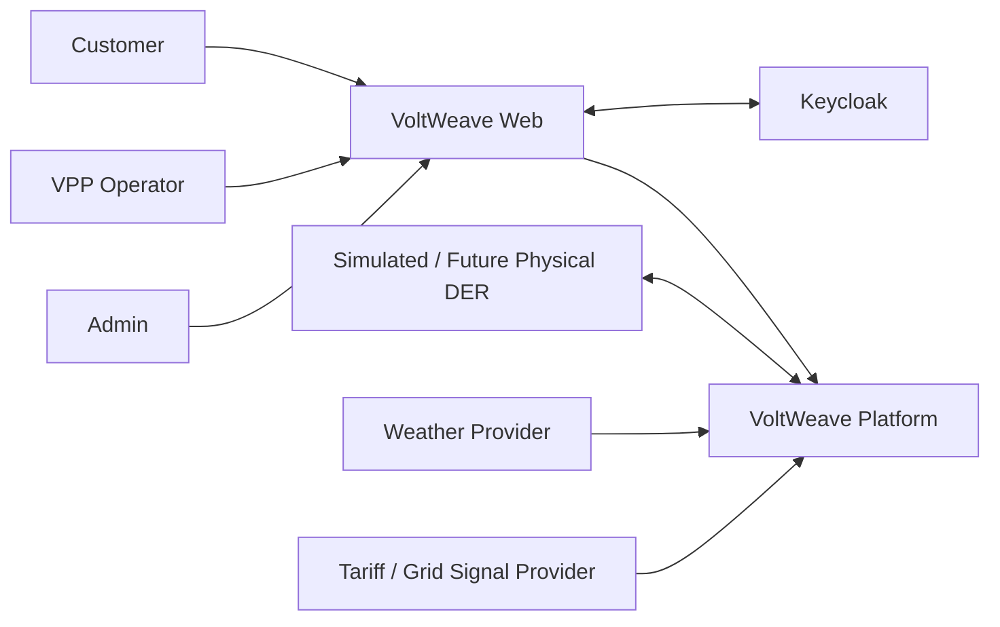
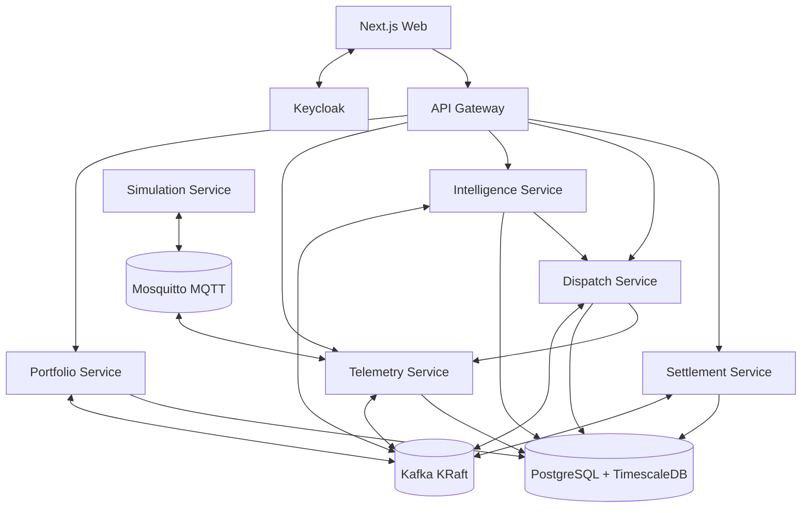
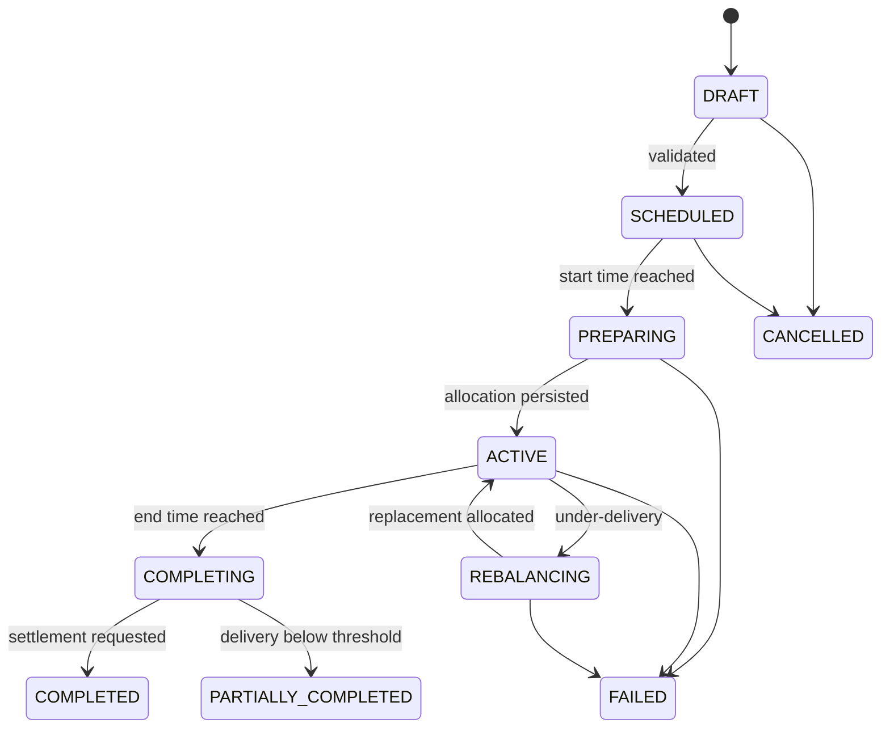
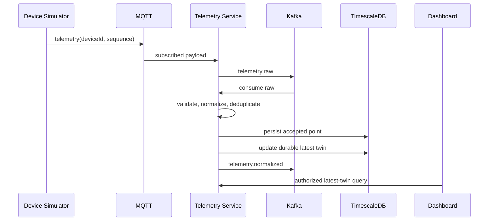
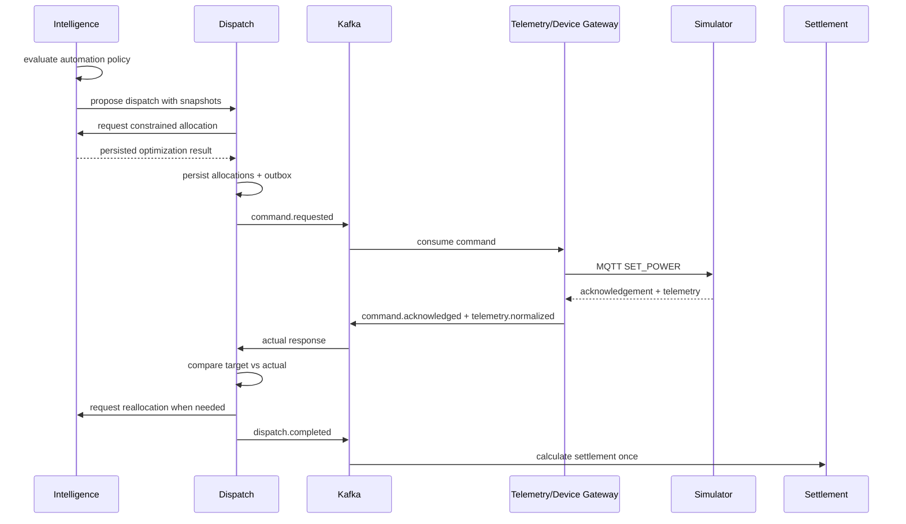

# VoltWeave V1
## Autonomous Distributed Energy Orchestration Platform

**Document:** V1 Product, System Design, Architecture and Delivery Plan  
**Status:** Implemented V1 baseline
**Date:** 2026-08-15

> Weave distributed energy resources into one adaptive virtual power plant.

---

# 1. Product decision

## 1.1 Name

The V1 product name is **VoltWeave**.

- **Volt** represents electrical energy.
- **Weave** represents coordinating many independent devices as one resource.
- The name describes aggregation and orchestration of distributed energy resources.

Recommended repository description:

> VoltWeave is an event-driven virtual power plant platform that observes, forecasts, optimizes and automatically dispatches simulated distributed energy resources while enforcing customer and device constraints.

## 1.2 Product promise

VoltWeave V1 shall complete this closed loop:

```text
OBSERVE
  -> FORECAST
  -> CALCULATE FLEXIBILITY
  -> OPTIMIZE
  -> DISPATCH
  -> COMMAND
  -> MEASURE
  -> REBALANCE
  -> SETTLE
  -> REWARD
```

The system is complete when this loop runs end-to-end, survives defined partial failures and produces reproducible measurements. Completeness is not measured by matching the 27-service inventory in the full production SRS.

## 1.3 V1 interpretation

V1 is **production-shaped, not utility-production-certified**:

- Real authentication, authorization, persistence and audit rules.
- Real Kafka delivery semantics, idempotency and transactional outbox.
- Real MQTT boundary used by the simulator.
- Real time-series persistence and realtime dashboard.
- Deterministic forecasting, constrained allocation and feedback control.
- Simulated DERs and simulated tariff/grid signals.
- Docker Compose acceptance and release environment.

V1 does not directly control physical electrical equipment or participate in a real electricity market.

---

# 2. V1 scope

## 2.1 Users

### CUSTOMER

- Manage sites and devices.
- Configure battery reserve and EV departure requirements.
- Opt a site into or out of VPP automation.
- View live energy flow, dispatch history and rewards.

### VPP_OPERATOR

- Create and manage VPPs.
- View fleet capacity, forecast and flexibility.
- Configure automation policies.
- Create, approve, cancel and monitor dispatches.
- Review performance and settlement.

### ADMIN

- Manage organization membership.
- Provision, disable and retire simulated devices.
- View audit and operational health.

`ENERGY_ANALYST` is represented by read-only operator access in V1; it does not require a separate role or portal.

## 2.2 Supported resources

| Resource | Observe | Control | V1 behavior |
|---|---:|---:|---|
| Smart meter | Yes | No | Net grid import/export and baseline input |
| Solar inverter | Yes | No | Generation telemetry and forecast input |
| Battery | Yes | Yes | Charge/discharge with SOC and safety limits |
| EV charger | Yes | Yes | Delay/modulate charging while meeting departure target |
| Flexible load | No | No | Deferred until a concrete load model is added |

## 2.3 Automation modes

Every VPP has an `AutomationPolicy`:

```text
AutomationPolicy
- id
- organizationId
- vppId
- enabled
- triggerType: MANUAL | PEAK_LIMIT | PRICE_THRESHOLD
- approvalMode: REQUIRE_OPERATOR | AUTO_DISPATCH
- peakImportLimitKw
- priceThreshold
- reserveMarginPercent
- maxDispatchPowerKw
- maxDispatchDurationMinutes
- underDeliveryTolerancePercent
- underDeliveryGraceSeconds
- rebalanceCooldownSeconds
- effectiveFrom
- version
```

Automation shall:

1. Refresh tariff, forecast and flexibility on schedule.
2. Detect a configured peak or price trigger.
3. Create a candidate dispatch.
4. Require approval or start automatically according to policy.
5. Allocate eligible resources.
6. Issue idempotent commands.
7. Compare target with actual telemetry.
8. Rebalance when under-delivery exceeds tolerance.
9. Complete, settle and post rewards once.

Safety constraints always override optimization and automation.

## 2.4 Deliberate V1 exclusions

- Physical vendor integrations beyond the MQTT adapter contract.
- Real market bidding or utility settlement.
- Real money transfer.
- XGBoost, LSTM, genetic algorithms and reinforcement learning.
- LP/MILP until weighted allocation is measured and shown insufficient.
- Multi-region active-active deployment.
- Separate services for identity profile, digital twin, command, performance, audit, configuration, scheduling, notification and reporting.
- PDF/XLSX generation; V1 exports CSV and JSON.
- Kubernetes, Kustomize, Helm and Terraform; Docker Compose is the V1 release boundary.

---

# 3. System architecture

## 3.1 System context



## 3.2 Deployable containers

The 27 target services from the production SRS are consolidated into six backend services plus the simulator.

| Deployable | Owns | Store |
|---|---|---|
| `api-gateway` | Public routing, JWT validation, rate limiting, correlation ID | None |
| `portfolio-service` | Organizations, memberships, sites, devices, preferences, VPPs, automation policies, audit projection | `portfolio_db` |
| `telemetry-service` | MQTT ingress, validation, normalization, telemetry history, latest twins and aggregates | `telemetry_db` |
| `intelligence-service` | Tariffs, weather, forecasts, flexibility snapshots, weighted optimization | `intelligence_db` |
| `dispatch-service` | Dispatch state machine, allocations, command lifecycle, delivery performance, rebalancing | `dispatch_db` |
| `settlement-service` | Baselines, delivered energy, settlement, immutable reward ledger, CSV reports | `settlement_db` |
| `simulation-service` | Synthetic devices, demand/solar profiles and fault injection | Scenario files only |

Keycloak, Kafka, Mosquitto and PostgreSQL/TimescaleDB are platform dependencies, not custom microservices.

## 3.3 Container architecture



## 3.4 Why these boundaries

- Portfolio data changes slowly and is transactional.
- Telemetry is high-volume, time-ordered and independently scalable.
- Intelligence is compute-oriented and may later gain different runtimes or solvers.
- Dispatch owns the durable workflow and must recover independently after restart.
- Settlement is financially sensitive and requires immutable, exactly-once business effects.
- Simulation is replaceable by real device/provider adapters without bypassing production ingress.

---

# 4. Core domain design

## 4.1 Sign and unit convention

All APIs, events and calculations use the following convention:

```text
gridPowerKw   > 0  = import from grid
gridPowerKw   < 0  = export to grid
devicePowerKw > 0  = consumption / charging
devicePowerKw < 0  = generation / discharging
dispatch target     = positive requested reduction in grid import
timestamps          = UTC ISO-8601
power               = kW
energy              = kWh
SOC                 = percent [0, 100]
```

Telemetry uses floating-point measurements. Monetary and posted reward calculations use decimal arithmetic with an explicit currency and rounding rule.

## 4.2 Main aggregates

### Portfolio

```text
Organization
OrganizationMember
Site
SitePreference
Device
BatteryConfiguration
EvChargerConfiguration
VirtualPowerPlant
VppMembership
AutomationPolicy
```

### Telemetry

```text
RawTelemetry
NormalizedTelemetry
InvalidTelemetry
DeviceTwin
SiteLiveState
VppLiveState
```

### Intelligence

```text
TariffPoint
WeatherPoint
Forecast
ForecastPoint
FlexibilitySnapshot
CandidateResource
OptimizationResult
```

### Dispatch

```text
Dispatch
DispatchAllocation
DeviceCommand
CommandAttempt
DispatchPerformancePoint
```

### Settlement

```text
Baseline
Settlement
SettlementLine
RewardLedgerEntry
```

## 4.3 Dispatch state machine



Transitions are validated in one domain state machine inside `dispatch-service`. Controllers and Kafka consumers cannot mutate status directly.

## 4.4 Flexibility calculation

Battery discharge flexibility for a dispatch duration `h`:

```text
usableEnergyKwh = capacityKwh * (currentSoc - reserveSoc) / 100
energyBoundKw   = usableEnergyKwh * efficiency / h
availableKw     = min(maxDischargeKw, energyBoundKw, siteExportHeadroomKw)
```

Result is zero when the device is offline, stale, opted out, outside temperature limits or already reserved by another dispatch.

EV charging flexibility is the amount of charging power that may be reduced while the target SOC remains reachable before departure.

## 4.5 V1 optimization

V1 uses a deterministic weighted greedy allocator:

1. Filter all candidates that violate hard constraints.
2. Calculate available power for the requested duration.
3. Score each candidate using normalized factors.
4. Sort by score, then stable device ID for deterministic ties.
5. Allocate until `target * (1 + reserveMargin)` is reached.
6. Persist the immutable input snapshot, weights and result.

```text
score =
    0.30 * reliability
  + 0.25 * availableSoc
  + 0.20 * responseSpeed
  + 0.15 * lowDegradationCost
  + 0.10 * customerPreference
```

Weights are versioned business configuration. Analysis mode may compare different weights, but only one active version controls a dispatch.

This heuristic is intentionally inspectable. LP/MILP is added only when a documented scenario proves the heuristic inadequate.

## 4.6 Forecasting

V1 forecast models:

- Load: same-time-of-day weighted moving average.
- Solar: weighted moving average adjusted by cloud cover when weather data is available.
- Forecast horizons: 15 minutes, 1 hour and day-ahead.
- Accuracy: MAE and sMAPE.

Every forecast retains model name, version, training window and generation timestamp. When the provider or forecast fails, the last valid forecast may be used only while it remains inside its configured freshness window; otherwise automation fails closed.

## 4.7 Baseline and delivered energy

For V1, dispatch delivery is measured against the retained site net-load forecast generated before dispatch:

```text
deliveredReductionKw(t) = max(0, baselineGridImportKw(t) - actualGridImportKw(t))
deliveredEnergyKwh      = sum(deliveredReductionKw * intervalSeconds / 3600)
```

The baseline ID and model version are immutable settlement inputs. Simulator-only counterfactual demand may be used to evaluate baseline accuracy, but it must not be used as the settlement source.

## 4.8 Reward ledger

- Posted ledger entries are immutable.
- Corrections are `ADJUSTMENT` or `REVERSAL` entries.
- `settlementId + entryType + participantId` is unique.
- Duplicate settlement events produce no duplicate financial effect.
- V1 rewards are simulated credits, not payments.

---

# 5. Event-driven design

## 5.1 Delivery semantics

- Kafka processing is at-least-once.
- Business consumers are idempotent.
- Transactional services use an outbox table committed with domain changes.
- A small polling publisher sends unsent outbox rows; Debezium is not required in V1.
- Telemetry deduplication uses `(deviceId, sequenceNumber)` with bounded retention rather than an unbounded processed-event table.

## 5.2 Event envelope

```json
{
  "eventId": "uuid",
  "eventType": "DispatchStarted",
  "eventVersion": 1,
  "occurredAt": "2026-08-11T13:20:00Z",
  "producer": "dispatch-service",
  "tenantId": "uuid",
  "correlationId": "uuid",
  "partitionKey": "dispatch-id",
  "payload": {}
}
```

JSON schemas are versioned in the repository and verified by contract tests. A schema-registry service is deferred until compatibility management cannot be handled by repository versioning.

## 5.3 V1 topics

| Topic | Key | Main producers/consumers |
|---|---|---|
| `vw.telemetry.raw.v1` | `deviceId` | Telemetry ingress → telemetry processor |
| `vw.telemetry.normalized.v1` | `deviceId` | Telemetry → intelligence, dispatch |
| `vw.portfolio.lifecycle.v1` | aggregate ID | Portfolio → telemetry, intelligence, dispatch |
| `vw.device.lifecycle.v1` | `deviceId` | Portfolio/telemetry → intelligence, dispatch |
| `vw.forecast.lifecycle.v1` | `vppId` | Intelligence → portfolio/web projections |
| `vw.flexibility.lifecycle.v1` | `vppId` | Intelligence → dispatch |
| `vw.optimization.lifecycle.v1` | `dispatchId` | Intelligence → dispatch |
| `vw.dispatch.lifecycle.v1` | `dispatchId` | Dispatch → intelligence, settlement, web |
| `vw.command.lifecycle.v1` | `deviceId` | Dispatch ↔ telemetry/device gateway |
| `vw.performance.lifecycle.v1` | `dispatchId` | Dispatch → web, settlement |
| `vw.settlement.lifecycle.v1` | `dispatchId` | Settlement → portfolio/web |
| `vw.audit.v1` | `tenantId` | All services → audit projection |

Each family has a corresponding `.dlq` only when retrying cannot safely progress the original event.

## 5.4 Command idempotency

- Every command has a globally unique `commandId`.
- The simulator/device stores recently executed command IDs.
- Repeated delivery returns the existing result without repeating the physical action.
- Expired commands are rejected.
- A later command supersedes an earlier command only through an explicit `supersedesCommandId`.

---

# 6. Critical runtime flows

## 6.1 Telemetry flow



## 6.2 Automated dispatch flow



## 6.3 Recovery rules

| Failure | Required behavior |
|---|---|
| Kafka unavailable after DB commit | Outbox remains pending and republishes later |
| Duplicate Kafka event | Inbox/unique business key makes processing harmless |
| Device offline | Excluded from new allocations; active dispatch may rebalance |
| Command timeout | Retry within validity window, then fail and rebalance |
| Dispatch service restart | Reload active state and resume from persisted deadlines |
| Forecast unavailable | Use fresh last-known forecast with conservative margin, else stop automation |
| Partial under-delivery | Rebalance after tolerance and grace period |
| Settlement consumer restart | Unique settlement/ledger keys prevent duplicate rewards |

---

# 7. External API surface

All public APIs are routed through `/api/v1`.

```http
# Portfolio
POST   /organizations
POST   /organizations/{id}/members
POST   /sites
PATCH  /sites/{id}/preferences
POST   /devices
POST   /devices/{id}/provision
POST   /vpps
POST   /vpps/{id}/members
PUT    /vpps/{id}/automation-policy

# Live energy and intelligence
GET    /sites/{id}/live
GET    /sites/{id}/telemetry
GET    /vpps/{id}/live
GET    /vpps/{id}/forecast
GET    /vpps/{id}/flexibility
POST   /vpps/{id}/optimization-preview

# Dispatch
POST   /dispatches
GET    /dispatches/{id}
POST   /dispatches/{id}/approve
POST   /dispatches/{id}/cancel
GET    /dispatches/{id}/timeline
GET    /dispatches/{id}/performance

# Settlement and reports
GET    /settlements/{id}
GET    /customers/me/rewards
GET    /reports/dispatches/{id}.csv

# Realtime
GET    /stream/sites/{id}
GET    /stream/vpps/{id}
GET    /stream/dispatches/{id}
```

Mutating endpoints that may be retried accept an `Idempotency-Key`. OpenAPI is generated from the application and checked into the release artifacts.

---

# 8. Security design

## 8.1 User identity

- Keycloak provides OIDC login and stores credentials.
- Application services are OAuth2 Resource Servers.
- JWT carries identity and coarse global roles only.
- Organization membership and resource ownership are checked from server-owned data.
- No custom identity microservice and no raw passwords in application databases.

## 8.2 Tenant isolation

- Every tenant-owned aggregate includes `organizationId`.
- Repository queries include the authorized organization scope.
- Cross-tenant access tests are mandatory for every resource type.
- Customer access is restricted to owned/authorized sites.
- Only operators owning a VPP may dispatch it.

## 8.3 Device identity

- Device provisioning creates a single-use credential.
- MQTT ACL limits a device to its own telemetry, acknowledgement and command topics.
- Credentials can be revoked when a device is disabled or retired.
- TLS is required in the deployed profile; local Compose may use an isolated plaintext network.

## 8.4 Audit

The following actions produce append-only audit events:

- Membership and role changes.
- Device provision, disable and retire.
- Site preference and opt-out changes.
- VPP membership and automation policy changes.
- Dispatch create, approve, cancel and manual intervention.
- Settlement and reward adjustment.

Audit metadata must not contain secrets or raw telemetry payloads.

---

# 9. Data and storage

## 9.1 Ownership

Local development uses one PostgreSQL/TimescaleDB server with separate databases/users. Services never write another service's database.

| Database | Important tables |
|---|---|
| `portfolio_db` | organizations, memberships, sites, devices, vpps, policies, audit projection, outbox |
| `telemetry_db` | telemetry hypertable, invalid telemetry, durable twin projection |
| `intelligence_db` | tariffs, weather, forecasts, flexibility snapshots, optimization results, outbox |
| `dispatch_db` | dispatches, allocations, commands, attempts, performance, inbox, outbox |
| `settlement_db` | baselines, settlements, settlement lines, reward ledger, inbox, outbox |

## 9.2 Telemetry lifecycle

- Raw invalid telemetry: retain 7 days.
- Accepted high-resolution telemetry: retain 30 days for V1 demo environments.
- Five-minute aggregates: retain indefinitely for the project dataset.
- Continuous aggregate/downsampling jobs run inside TimescaleDB.
- Retention values remain configurable because real deployments have different cost and compliance requirements.

## 9.3 Latest-state projection

The latest device twin is stored durably in `telemetry_db`. The V1 web application
uses authenticated HTTP reads; a cache or realtime fanout layer should only be
introduced after measured load justifies it.

---

# 10. Technology baseline

Versions are pinned in the repository and updated deliberately, not automatically across major versions.

| Area | V1 choice |
|---|---|
| Language | Java 21 LTS |
| Backend | Spring Boot 4.1.x, Spring MVC, Spring Security, Spring Data JPA, Spring Kafka, Actuator |
| Gateway | Spring Cloud Gateway Server Web MVC |
| Build | Maven Wrapper, multi-module monorepo |
| Database | PostgreSQL 18 + TimescaleDB 2.29.x |
| Migrations | Flyway |
| Event streaming | Apache Kafka 4.3.x in KRaft mode |
| IoT | Eclipse Mosquitto 2.x / MQTT 5 |
| Identity | Keycloak 26.7.x |
| Frontend | Next.js 16.3.x, React, TypeScript, Tailwind CSS |
| Observability | Micrometer, Prometheus, Grafana, ECS structured logging |
| Testing | JUnit 5, AssertJ, Testcontainers, Maven Failsafe, k6 |
| Delivery | Docker, Docker Compose, GitHub Actions, Gitleaks |

Implementation rules:

- Use Spring MVC and authenticated HTTP reads for the V1 browser application.
- Use synchronous REST only for request/response queries that require an immediate answer.
- Use Kafka for durable domain facts and asynchronous workflow transitions.
- Use database constraints for uniqueness and referential rules inside a service boundary.
- Use Resilience4j only around real external provider calls.
- Keep scheduled jobs inside the service that owns the data; use PostgreSQL advisory locks when more than one replica may run the same job.
- Do not introduce a service registry; Compose DNS already provides discovery.
- Do not create a shared domain-model library. Only event schemas and test utilities may be shared.

---

# 11. Repository design

```text
voltweave/
├── pom.xml
├── services/
│   ├── api-gateway/
│   ├── portfolio-service/
│   ├── telemetry-service/
│   ├── intelligence-service/
│   ├── dispatch-service/
│   └── settlement-service/
├── simulator/
│   └── simulation-service/
├── web/
│   └── voltweave-web/
├── contracts/
│   ├── events/
│   └── openapi/
├── infrastructure/
│   ├── compose/
│   ├── keycloak/
│   ├── mosquitto/
│   ├── observability/
│   └── k8s/
├── tests/
│   ├── e2e/
│   └── performance/
├── docs/
│   ├── architecture/
│   ├── adr/
│   └── runbooks/
└── .github/workflows/
```

One monorepo and one Maven reactor build are enough for V1. Each backend service still produces its own container image and owns its migrations.

---

# 12. Delivery plan

Expected solo effort is **14–18 weeks full-time** or **5–7 months part-time**. Each milestone ends with runnable behavior, not scaffolding.

## M0 — Product baseline

- Rename the working product to VoltWeave.
- Initialize Git and repository structure.
- Add root README, architecture decision log and issue board.
- Define unit/sign convention and event envelope.

**Exit:** architecture and scope are versioned; no service code is required yet.

## M1 — Domain kernel

- Implement battery flexibility, EV latest-safe-charge calculation, weighted allocation and energy integration as plain Java domain code.
- Add deterministic tests for safety constraints and rounding.

**Exit:** the core optimization can be demonstrated without Spring or infrastructure.

## M2 — Identity and portfolio

- Start Keycloak and PostgreSQL through Compose.
- Implement organization, site, device, VPP and preference APIs.
- Enforce CUSTOMER/OPERATOR/ADMIN authorization and tenant isolation.
- Add Flyway migrations and API integration tests.

**Exit:** two organizations cannot access each other's resources.

## M3 — Device path and simulator

- Start Mosquitto and Kafka KRaft.
- Implement device provisioning and MQTT ACL configuration.
- Simulate meter, solar, battery and EV charger behavior.
- Publish sequenced telemetry and accept idempotent commands.

**Exit:** a provisioned device connects through the same MQTT boundary intended for a real adapter.

## M4 — Telemetry and digital twins

- Implement raw topic, validation, normalization, deduplication and quarantine.
- Store accepted points in TimescaleDB.
- Maintain durable latest-device twins.
- Expose tenant-authorized telemetry reads through Gateway.

**Exit:** accepted telemetry and the latest twin survive service restart.

## M5 — Forecast and flexibility

- Ingest simulated tariffs and one weather-provider adapter.
- Generate load and solar baselines.
- Compute site/VPP flexibility with immutable input snapshots.
- Record accuracy metrics.

**Exit:** every VPP exposes current capacity, forecast and explainable flexibility.

## M6 — Optimization and autopilot

- Implement weighted deterministic allocation.
- Version weights and automation policies.
- Support manual preview, operator approval and automatic trigger modes.
- Return explicit infeasible results.

**Exit:** a peak-limit policy proposes or creates a safe dispatch automatically.

## M7 — Dispatch and commands

- Implement state machine, allocations, command outbox and acknowledgements.
- Persist deadlines and resume active dispatches after restart.
- Add dispatch timeline and command inspection APIs.

**Exit:** a scheduled dispatch controls simulated devices end-to-end.

## M8 — Closed-loop recovery

- Continuously calculate target versus actual response.
- Detect under-delivery with tolerance/grace period.
- Re-optimize after offline, timeout or under-performing devices.
- Prevent conflicting device allocations.

**Exit:** disconnecting 10% of selected batteries causes measured recovery without manual commands.

## M9 — Settlement and rewards

- Freeze baseline before dispatch.
- Integrate delivered energy per participant.
- Calculate settlement and post immutable reward entries.
- Add duplicate-event test and CSV dispatch report.

**Exit:** replaying completion events never creates duplicate rewards.

## M10 — Product UI

- Customer: live energy, devices, preferences, participation and rewards.
- Operator: fleet, forecast, flexibility, automation policy and dispatch detail.
- Admin: provisioning and audit view.
- Add responsive and accessible states for loading, empty, error and reconnect.

**Exit:** the mandatory scenario can be completed without database or Kafka tooling.

## M11 — Reliability and security

- Add outbox/inbox everywhere business consistency requires it.
- Add retry, expiry, DLQ inspection and controlled replay.
- Test forged/expired JWT, cross-tenant IDOR, command replay and device spoofing.
- Add structured logs and secret scanning.

**Exit:** all defined recovery and security scenarios have automated checks.

## M12 — Observability and performance

- Add metrics, traces, dashboards and alerts.
- Benchmark telemetry ingestion, dashboard freshness and dispatch latency.
- Run restart, duplicate and backlog recovery tests.
- Document hardware and exact commands.

**Exit:** published claims are reproducible from repository scripts.

## M13 — Release

- Produce non-root multi-stage images.
- Make `docker compose up` the primary acceptance path.
- Write runbooks, ADRs, demo script and record a short video.

**Exit:** a new reviewer can clone, start, run the acceptance demo and understand the architecture.

---

# 13. Test strategy

## 13.1 Unit

- Battery and EV constraints.
- Forecast calculations.
- Allocation determinism and infeasibility.
- Dispatch state transitions.
- Baseline and interval energy integration.
- Decimal reward calculation.

## 13.2 Integration

Use Testcontainers for PostgreSQL/TimescaleDB, Kafka and Mosquitto where the boundary matters. Do not mock persistence or Kafka behavior in tests claiming integration coverage.

## 13.3 Contract

- Validate all emitted JSON events against versioned schemas.
- Test backward-compatible deserialization of supported event versions.
- Verify OpenAPI generation and breaking changes in CI.

## 13.4 End-to-end

Mandatory automated flows:

1. Login → site → device → provision → MQTT telemetry → twin.
2. VPP membership → forecast → flexibility → optimization preview.
3. Dispatch → allocation → command → acknowledgement → actual delivery.
4. Device failure → under-delivery → rebalancing → target recovery.
5. Completion → baseline → settlement → exactly one reward.
6. Dispatch-service restart during ACTIVE → workflow resumes.
7. Cross-tenant access → denied.

## 13.5 Performance targets

Initial acceptance environment:

```text
5,000 simulated devices
1 telemetry message / 5 seconds / device
1,000 telemetry events/second sustained for 10 minutes
```

Targets:

- Transactional API p95 below 300 ms under documented test load.
- Accepted telemetry visible on dashboard below 2 seconds p95.
- Simulated command acknowledgement below 3 seconds p95.
- Under-delivery detection and replacement command below 10 seconds p95.
- Zero duplicate reward effects during replay tests.
- No unbounded Kafka lag after the sustained run ends.

The 24,000-device / 4,800 events-per-second model from the production SRS is a stretch benchmark, not an unmeasured V1 claim.

---

# 14. Observability

Every HTTP request and event carries `correlationId`; distributed traces also carry W3C trace context.

Required dashboards:

- API p50/p95/p99 and error rate.
- JVM memory/GC and database pool.
- Kafka throughput, lag and DLQ count.
- Telemetry accepted/invalid/duplicate/stale rate.
- Online/offline device count.
- Forecast error and flexibility.
- Dispatch target/allocated/acknowledged/actual.
- Command latency and timeout rate.
- Rebalancing count and recovery time.
- Settlement backlog and duplicate protection.

Required alerts for the demo profile:

- Service unavailable.
- Kafka lag above threshold.
- Sudden telemetry drop.
- Mass device offline.
- Active dispatch under-delivery.
- Settlement failure/DLQ growth.

---

# 15. V1 acceptance demonstration

```text
1. Start the complete stack with Docker Compose.
2. Login as customer and create a site.
3. Register meter, solar, battery and EV charger simulators.
4. Set battery reserve and EV departure target.
5. Observe live telemetry and energy flow.
6. Login as operator and create a VPP.
7. Add the site and enable a peak-limit automation policy.
8. Simulated evening demand crosses the configured limit.
9. VoltWeave generates forecast and flexibility snapshots.
10. The optimizer creates an explainable allocation.
11. The dispatch starts and devices acknowledge commands.
12. Target and actual power appear live.
13. Disconnect 10% of selected batteries.
14. VoltWeave detects under-delivery and reallocates resources.
15. The target recovers within the configured tolerance.
16. Dispatch completes and delivered energy is integrated.
17. Settlement posts exactly one reward per participant.
18. Customer sees the reward; operator exports the CSV report.
19. Audit view shows privileged/business actions.
20. Grafana and traces explain the entire run.
```

No step may bypass MQTT, Kafka or the public application APIs by directly editing a database.

---

# 16. Definition of Done

VoltWeave V1 is complete only when:

- All mandatory acceptance steps pass from a clean checkout.
- Authentication, tenant authorization and device provisioning work.
- All four V1 resource simulators produce valid telemetry.
- Battery and EV commands respect hard constraints.
- Forecast, flexibility and weighted allocation are inspectable and versioned.
- Manual and automatic dispatch modes work.
- Active dispatch survives service restart.
- Device loss triggers closed-loop rebalancing.
- Baseline, settlement and immutable reward ledger work.
- Duplicate events are harmless at financial and command boundaries.
- Realtime UI, CSV export and audit view work.
- Docker Compose, CI, tests and observability work.
- Performance results include hardware, dataset, duration and commands.
- README, diagrams, ADRs, runbooks and demo video are present.

The following do **not** block V1 completion: 27 separate services, real DER hardware, real market participation, LP/MILP, multi-region HA, Helm, Terraform, PDF or XLSX reports.

---

# 17. Required ADRs

1. Why six backend services instead of the 27-service target inventory.
2. Why Kafka is used for durable events and REST for immediate queries.
3. Why TimescaleDB is used for telemetry.
4. Why MQTT is the device boundary.
5. Why Keycloak replaces a custom identity service.
6. Why V1 uses weighted greedy optimization before LP/MILP.
7. Why transactional outbox uses polling before CDC/Debezium.
8. Why settlement uses an immutable ledger.
9. Why Docker Compose is the V1 acceptance and release environment.

---

# 18. Implementation outcome

The V1 baseline is implemented and reproducible through the repository release,
demo and verification scripts. `VOLTWEAVE_TARGET_SRS.md` remains the long-term
target-system reference; production hardware, market integrations and orchestrated
cloud deployment require separate delivery plans.
